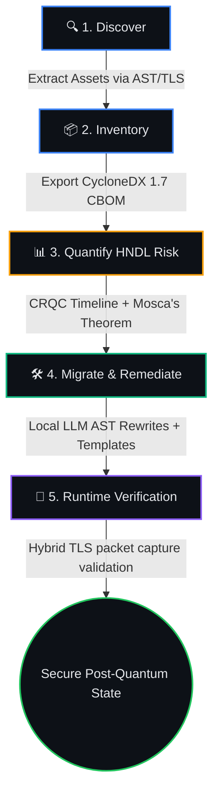

<div align="center">
  <h1>QUBIT</h1>
  <p><b>Quantum Upgrade Bridge & Inventory Tool</b></p>
  <p><i>Harvest-Now-Decrypt-Later (HNDL) Risk Modeling & Automated Post-Quantum Cryptographic Migration</i></p>

  
  
  
  
</div>

---

## 📖 Overview & The Post-Quantum Threat

As Cryptographically Relevant Quantum Computers (CRQCs) approach maturity, existing public-key cryptography (such as RSA and ECC) faces an existential threat from Shor's algorithm. For sensitive data, the threat is not years away; it is happening today through **Harvest-Now-Decrypt-Later (HNDL)** attacks. Adversaries are actively intercepting and storing encrypted traffic today with the explicit intent to decrypt it once quantum hardware is available.

**QUBIT** is an open-source, production-ready platform engineered to automatically discover, quantify, and remediate this risk across complex enterprise environments. It provides a mathematically rigorous, end-to-end pipeline to transition codebases and infrastructure to NIST-standardized Post-Quantum Cryptography (PQC), specifically **ML-KEM** and **ML-DSA**.

QUBIT operates **fully offline**, leverages a **local LLM** (e.g., Qwen2.5-Coder) for code transformation to ensure data privacy, and emits standards-compliant **CycloneDX 1.7 Cryptographic Bill of Materials (CBOM)** artifacts.

---

## 🚀 The End-to-End Pipeline

QUBIT provides a cohesive, five-stage pipeline to secure cryptographic assets. The platform ensures that code changes are safe, measurable, and provably effective.



### 1. Discovery & Enumeration
QUBIT's multi-modal scanners discover every cryptographic primitive in an organization. It uses **tree-sitter** for deep AST parsing of source code (Python, Java, Go), active TLS handshake enumeration for network endpoints, and parsing modules for configuration files and X.509 certificates.

### 2. CycloneDX 1.7 Inventory
Discovered primitives are mapped to a canonical schema and persisted to a centralized database. The system exports this data as a **CycloneDX 1.7 Cryptographic Bill of Materials (CBOM)**, fulfilling emerging federal and industry compliance mandates for cryptographic agility.

### 3. HNDL Risk Quantification
The risk engine models the probability of quantum decryption over time. It fuses a **Monte-Carlo hardware simulation** of CRQC arrival times with a blended expert survey (GRI-2025). The engine classifies asset sensitivity (PII, PHI, Financial) via a DistilBERT classifier, and calculates risk severity using **Mosca's Inequality** (Margin = Arrival Time - (Shelf Life + Migration Time)). 

### 4. Automated Migration
A sophisticated orchestrator constructs a dependency graph of the assets and prioritizes them using **Weighted Shortest Job First (WSJF)**. It generates deterministic code patches via `libcst` templates, and where structural rewrites are required (e.g., upgrading an RSA Key Exchange to an ML-KEM-768 KEM-DEM), it delegates to a local, sandboxed LLM. 

### 5. Verification & Hybrid TLS Bridge
No patch is trusted blindly. QUBIT stands up a **Hybrid PQC TLS terminator** (using OpenSSL 3.5+) that negotiates `X25519MLKEM768`. The system performs a live packet capture and a continuous re-scan of the remediated source code to guarantee that the Shor-vulnerable primitives have been eradicated.

---

## 🏗️ Architecture & Monorepo Structure

QUBIT is engineered as a robust Python monorepo managed by `uv`. The system enforces extreme modularity: packages communicate strictly through shared SQLAlchemy models and a normative REST API. There are no private cross-package imports.

| Module | Role & Core Technologies |
|---|---|
| 📦 **`qubit-core`** | **The Source of Truth.** Defines the shared `CryptoAsset` Pydantic schemas, canonical algorithm registry, SQLAlchemy DB models, Alembic migrations, and CBOM interchange utilities. |
| 🔍 **`qubit-scanner`** | **Discovery Engine.** Analyzes code via `tree-sitter`, enumerates live network TLS groups, and extracts cryptographic configuration and keys. Normalizes inputs deterministically. |
| 📊 **`qubit-risk`** | **The HNDL Engine.** Houses the Monte-Carlo CRQC timeline simulator, Bayesian networks, the XGBoost regressor, and Mosca's margin calculator. |
| 🛠️ **`qubit-migrate`** | **The Orchestrator.** Implements a 12-state Finite State Machine (FSM) for patches. Drives the local LLM transformations and `libcst` templates. Hardened against prompt-injections. |
| 🌉 **`qubit-bridge`** | **Runtime Validation.** Orchestrates the OpenSSL 3.5+ hybrid classical+PQC TLS bridge, client-side probe tools (`s_client`), and the offline validation sandbox. |
| 🔌 **`qubit-api`** | **The Control Plane.** A high-performance FastAPI service acting as the normative REST registry. Houses the `JobRunner` orchestration system and Server-Sent Events (SSE) streams. |
| 💻 **`qubit-cli`** | **The Typer CLI.** Provides developer ergonomics via the `qubit` entrypoint (e.g., `qubit scan`, `qubit migrate plan`). |
| 🎨 **`dashboard`** | **The User Interface.** A React 18 + Vite 8 frontend built with TailwindCSS v4. Features a stunning dark "liquid glass" UI to visualize the migration queue, risk posture, and patch diffs. |

---

## 🧪 Evaluation & Research

QUBIT is the foundation of an Annexure-1 / SCOPUS research paper exploring automated cryptographic agility. The project includes four rigorous evaluation suites (`experiments/run_all.py`):
- **E1 (Discovery):** Precision, Recall, and F1 scores against baseline AST scanners (CryptoGuard, CogniCrypt).
- **E2 (Risk):** Calibration of the CRQC Monte-Carlo probability density functions.
- **E3 (Transformation):** LLM Patch generation success rate (Pass@k) in a sandboxed compilation environment.
- **E4 (Performance):** Hybrid TLS handshake overhead analysis via network emulation (`tc netem`).

---

## ⚙️ Quick Start

### 1. Prerequisites
- **Python 3.12+** (Managed by `uv`)
- **uv** (Fast Python package manager: `winget install --id astral-sh.uv -e`)
- **Node.js 22+** (For the React dashboard)
- **Docker Desktop** (For sandbox validation and the OpenSSL 3.5 base image)
- **Ollama** (Required for LLM migrations: `ollama pull qwen2.5-coder:7b-instruct-q4_K_M`)

### 2. Running the Complete Platform
To bring up the FastAPI backend, the React Dashboard, and the vulnerable `demo-lab` targets:

```bash
# Clone the repository
git clone https://github.com/qubit-project/qubit.git
cd qubit

# Bring up the entire stack
docker compose up
```
* The Dashboard will be available at `http://localhost:5173`.
* The API will be available at `http://localhost:8000`.

### 3. Using the CLI Locally
You can run QUBIT entirely from your terminal against any local codebase.

```bash
# Install the CLI locally
pip install qubit-cli

# Step 1: Discover crypto assets and export a CBOM
qubit scan ./my-project --cbom out.json

# Step 2: Run the Monte-Carlo risk engine to score vulnerabilities
qubit risk run -p default

# Step 3: Generate a ranked migration queue and execute LLM patches
qubit migrate plan -p default
qubit migrate apply --auto-approve
```

---

## 🛠️ Developer Guide

QUBIT is under active development. To contribute or build from source:

```bash
# Sync the workspace and install dev dependencies
uv sync --all-packages --group dev

# Run the strict quality gates (Ruff, Mypy, and Pytest)
uv run poe check
```

*Note: QUBIT enforces a strict ≥70% test coverage threshold and 0 linting errors on the core packages.*

## 📜 License

This project is licensed under the **MIT License** — see the [LICENSE](LICENSE) file for details. Third-party benchmark corpora and baseline tools used in evaluations are run-only and are subject to their respective upstream licenses.
