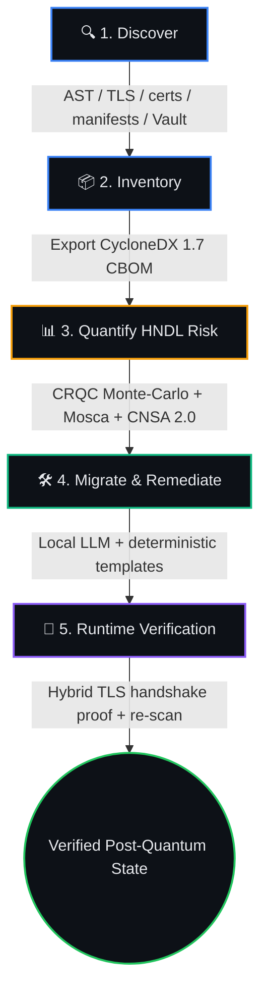

<div align="center">
  <h1>QUBIT</h1>
  <p><b>Quantum Upgrade Bridge &amp; Inventory Tool</b></p>
  <p><i>Harvest-Now-Decrypt-Later (HNDL) Risk Modeling &amp; Automated Post-Quantum Cryptographic Migration</i></p>

  
  
  
  
  
  
</div>

---

## 📖 Overview & The Post-Quantum Threat

As Cryptographically Relevant Quantum Computers (CRQCs) approach maturity, existing public-key cryptography (such as RSA and ECC) faces an existential threat from Shor's algorithm. For sensitive data, the threat is not years away; it is happening today through **Harvest-Now-Decrypt-Later (HNDL)** attacks. Adversaries are actively intercepting and storing encrypted traffic today with the explicit intent to decrypt it once quantum hardware is available.

**QUBIT** is an open-source platform engineered to automatically discover, quantify, and remediate this risk. It provides an end-to-end pipeline to transition codebases and infrastructure to NIST-standardized Post-Quantum Cryptography (PQC), specifically **ML-KEM** (FIPS 203) and **ML-DSA** (FIPS 204).

QUBIT operates **fully offline** with no telemetry, leverages a **local LLM** (Ollama) for code transformation so source never leaves the machine, and emits standards-compliant **CycloneDX 1.7 Cryptographic Bill of Materials (CBOM)** artifacts.

> **Honest status.** QUBIT is production-*grade* (real scanning, typed, 879 tests passing with zero skips, CI, git-safe DB migrations, a live hybrid-PQC TLS bridge) but not yet production-*hardened* — see [Project status](#-project-status) for exactly what is and isn't done, including a security review of the deployed surface and the hardening gaps that remain.

---

## 🚀 The End-to-End Pipeline


```mermaid
graph TD
    A[🔍 1. Discover] -->|AST / TLS / certs / manifests / Vault| B[📦 2. Inventory]
    B -->|Export CycloneDX 1.7 CBOM| C[📊 3. Quantify HNDL Risk]
    C -->|CRQC Monte-Carlo + Mosca + CNSA 2.0| D[🛠️ 4. Migrate &amp; Remediate]
    D -->|Local LLM + deterministic templates| E[🌉 5. Runtime Verification]
    E -->|Hybrid TLS handshake proof + re-scan| F((Verified Post-Quantum State))

    style A fill:#0d1117,stroke:#3b82f6,color:#e5e7eb,stroke-width:2px
    style B fill:#0d1117,stroke:#3b82f6,color:#e5e7eb,stroke-width:2px
    style C fill:#0d1117,stroke:#f59e0b,color:#e5e7eb,stroke-width:2px
    style D fill:#0d1117,stroke:#10b981,color:#e5e7eb,stroke-width:2px
    style E fill:#0d1117,stroke:#8b5cf6,color:#e5e7eb,stroke-width:2px
    style F fill:#0d1117,stroke:#22c55e,color:#e5e7eb,stroke-width:2px
```

### 1. Discovery & Enumeration
Five independent scanner sources, all real:

| Source | What it does |
|---|---|
| **Code (AST)** | `tree-sitter` parsing driven by a data-only `qubit-rule/v1` YAML catalog — **154 rules across Python (39), Go (32), Java (21), JavaScript (25), TypeScript (25), C/C++ (12)**, covering key generation *and use* (sign/verify/encrypt/decrypt), symmetric ciphers, hashes, MACs, KDFs, JWT/JOSE, WebCrypto, OpenSSL EVP, TLS configuration, and the most-installed third-party crypto libraries. Every rule ships its own positive/negative fixtures, executed as tests. The Go pack covers the one-shot digest helpers (`md5.Sum`, `sha1.Sum`) as well as the streaming `New()` forms — matching only the latter meant a package that hashed with `md5.Sum`, which is the more idiomatic Go spelling, was reported as using no MD5 at all. |
| **Config** | **nginx, Apache httpd/mod_ssl, and OpenSSH** `sshd_config`/`ssh_config` — protocol versions, cipher suites, MACs, **key-exchange groups** (`ssl_ecdh_curve`, `SSLECDHCurve`, `SSLOpenSSLConfCmd Curves`) and host-key algorithms. Cipher-suite names resolve in **both** spellings — IANA `TLS_..._WITH_...` and the OpenSSL form real configs actually contain (`ECDHE-RSA-AES128-SHA`) — each reducing to the component that governs HNDL risk, with a prefix-less suite correctly read as static RSA key transport. OpenSSH vendor suffixes, DH group numbers, and the PQC hybrid KEX (`sntrup761x25519-sha512@openssh.com`) all resolve to real algorithms and sizes; a bare curve in a key-exchange list is reported as ECDH, not as a signature. |
| **Network TLS** | Live handshake enumeration, plus a **raw-ClientHello PQC-group probe** that detects `X25519MLKEM768` / `SecP256r1MLKEM768` / `SecP384r1MLKEM1024` support with no OpenSSL dependency and no key generation (RFC 8446 HelloRetryRequest technique). |
| **Certificates & keys** | X.509 PEM/DER parsing → public-key algorithm, key size, signature algorithm. |
| **Dependencies** | `go.mod` / `package.json` / `requirements.txt` / `pyproject.toml` / `pom.xml` → a package→algorithm map of **850 packages across npm (776), PyPI (37), Go (22) and Maven (15)**, imported from the real [csnp/cryptodeps](https://github.com/csnp/cryptodeps) dataset (Apache-2.0, see [THIRD_PARTY_NOTICES.md](THIRD_PARTY_NOTICES.md)) rather than hand-written. Upstream's own `quantumRisk`/`severity` labels are deliberately **not** imported: entries name QUBIT canonical algorithms and the registry decides the verdict, so there is one source of truth. Hand-curated entries win on conflict because they carry **version-aware capability gates** the upstream data has no equivalent for, so a library too old to have ML-KEM is never credited with it. **This is a package→algorithm map, not a vulnerability database** — it says which algorithms a dependency brings, not which CVEs it has. |
| **HashiCorp Vault** *(opt-in)* | Polls `transit` keys and `pki` certificates over Vault's HTTP API, including its `ml-dsa` / `slh-dsa` / `hybrid` key types. |

### 2. CycloneDX 1.7 Inventory
Findings normalize into the frozen `CryptoAsset` schema against a canonical registry of **120 algorithms** (RSA/ECDSA/EdDSA/AES/SHA families, the JOSE-JWT `RS*`/`PS*`/`ES*`/`HS*`/`EdDSA` identifiers, ML-KEM, ML-DSA, SLH-DSA, and hybrid TLS groups). The DB is the source of truth; the CBOM is the exportable compliance artifact, validated against the official ECMA-424 schema.

### 3. HNDL Risk Quantification
A **Monte-Carlo simulation** of CRQC arrival blended with an expert-survey prior, a Bayesian network for HNDL exposure, a sensitivity classifier (PII/PHI/financial/credentials), an XGBoost regressor with split-conformal confidence intervals, and **Mosca's Inequality** (`margin = Z − (X + Y)`). A separate **CNSA 2.0 milestone evaluator** scores an inventory against NSA's regulatory deadlines (2025 → 2035) — a deterministic deadline source alongside the probabilistic one.

### 4. Automated Migration
A dependency graph plus WSJF prioritization feeds a 12-state FSM. **14 transform rules** cover every asset class QUBIT discovers — web-server and OpenSSH configuration, dependency manifests, and code across Python/Go/C/JS/TS/Java — each declaring its target, its `data_compat` hazard (`in_place` / `dual_read` / `reencrypt_required`), and a worked example that doubles as few-shot prompt content. Coverage is measured rather than asserted: a guard test sweeps **every detection rule's own positive examples** and requires that every vulnerable asset the scanner can produce has a transform rule that matches it — currently **100%** (it was 31% before this was measured). The classes deliberately excluded are the ones no code patch can fix, each with the operational action it needs instead: certificate reissue, HSM/Vault key rotation, and live-endpoint findings that are remediated by hardening the server's own config.

The division of labour between deterministic codemods and the **local, sandboxed LLM** is explicit rather than incidental. Where the correct output is a *constant* — `ssl_ecdh_curve X25519MLKEM768`, `KexAlgorithms sntrup761x25519-sha512@openssh.com`, a dependency version floor — the codemod is marked `codemod_authoritative` and an LLM never replaces it, even when one is explicitly requested: a 7B model asked to harden an nginx.conf produced a config that *looked* modern (TLS 1.2+1.3, AEAD suites) while silently omitting the hybrid group, which is the one line that actually makes the deployment quantum-safe. The LLM is used where the transform needs judgement about surrounding code (key lengths, nonce handling, call-site changes), behind a repair loop that feeds rejections back for up to 3 attempts and a preservation guard that refuses a rewrite which drops unrelated code or fails to parse.

Because remediation output is also scanner *input*, hardened files are re-scanned and asserted on: the algorithms the codemods write must resolve in the canonical registry and must be rated quantum-safe, so a migration can prove where it landed instead of reporting its own output as `UNKNOWN`. A versioned migration knowledge base (`migration_kb.yaml`) and crypto-agility policy decide each target. Governance gates require sign-off before a patch can be applied.

### 4b. Reports — one format per audience

Chosen from what security teams actually consume, not from what was easiest to emit. `qubit report <path> -f pdf|sarif|json`:

| Format | Audience | Why this one |
|---|---|---|
| **SARIF 2.1.0** | AppSec / SOC analysts | An [OASIS standard](https://docs.github.com/en/code-security/concepts/code-scanning/sarif-files). Upload with `github/codeql-action/upload-sarif@v3` and each finding becomes a code-scanning alert **annotated on the offending line**; VS Code and Azure DevOps read the same schema. QUBIT's stable asset fingerprint is passed through as `partialFingerprints`, which is how GitHub keeps an alert identical across commits instead of closing and reopening it whenever code shifts above the finding. `error` is reserved for Shor-breakable public key — the only class whose compromise is retroactive. |
| **PDF** | Compliance, audit, leadership | [EO 14412](https://www.qusecure.com/pqc-migration-executive-orders/) (June 2026) and OMB M-26-15 make cryptographic inventory a *reporting* obligation with fixed dates, and what gets filed and archived is a paginated document. The report states posture against those deadlines — high-value assets on PQC key establishment by 2030-12-31 — rather than only printing scores. Rendered with `reportlab` (pure Python, no system libraries), so it works fully offline. |
| **CycloneDX 1.7 CBOM** | Supply-chain tooling, agency inventory | The machine format the regulations actually **name** (ECMA-424). Already available via `qubit cbom export`, byte-reproducible with `--reproducible`. |
| **JSON** | SIEM / spreadsheets | The raw risk-annotated inventory. |

All three are reachable from the app, not just the CLI. The Report page composes the same data on
screen and offers **Download PDF report** and **SARIF** buttons that fetch the real server-generated
artifacts (`GET /scans/{id}/report.pdf`, `GET /scans/{id}/sarif`) — distinct from its **Print page**
button, which is a browser rendering of the page rather than the composed document. A dedicated
**CNSA 2.0** page (`GET /scans/{id}/cnsa2`) shows milestone posture.

> **Why this is called out.** The PDF and SARIF writers, and the CNSA 2.0 evaluator, were all real,
> tested code that the app could not reach: the reports were CLI-only, and the CNSA 2.0 evaluator had
> no caller outside its own unit tests. The dashboard's PDF button was `window.print()`. Backend
> capability that no interface exposes is not a shipped feature, and a test suite that only exercises
> the Python will keep reporting success anyway — so these now have API routes, UI, API tests and
> real-browser tests.
>
> The CNSA 2.0 page deliberately shows **two** numbers. `overall_score` is *schedule adherence* — a
> milestone that is not yet due scores full marks, so it can read 100% while most milestones are
> unmet. Beside it the page shows **PQC readiness** (milestones actually satisfied, e.g. 1/5).
> Reporting the score alone under a "compliance" heading would tell a user they were done when they
> were not, which is the same conflation the upstream reference implementation had to fix.

### 5. Verification & Hybrid TLS Bridge
No patch is trusted blindly: every patch is validated in a Docker sandbox and proven by re-scan. The bridge stands up a **hybrid PQC TLS terminator** on native **OpenSSL 3.5+** negotiating `X25519MLKEM768`, then swaps classical→hybrid **on the same port** and verifies the negotiated group.

---

## 🏗️ Architecture & Monorepo Structure

A Python monorepo managed by `uv`. Packages communicate strictly through `qubit-core` models, the database, and the REST API — no private cross-package imports (enforced in CI).

| Module | Role & Core Technologies |
|---|---|
| 📦 **`qubit-core`** | **Source of truth.** Frozen `CryptoAsset` Pydantic + SQLAlchemy models, the canonical algorithm registry, Alembic migrations (applied automatically at startup), fingerprinting, evidence redaction, CBOM export/import. |
| 🔍 **`qubit-scanner`** | **Discovery engine.** The five sources above, plus deterministic normalization and dedup. |
| 📊 **`qubit-risk`** | **HNDL engine.** CRQC Monte-Carlo timeline, Bayesian network, sensitivity classifier, XGBoost regressor, Mosca margin, CNSA 2.0 policy. All parameters live in versioned YAML with a reproducibility hash. |
| 🛠️ **`qubit-migrate`** | **Orchestrator.** Dependency graph, WSJF queue, FSM, LLM + template transforms (prompt-injection hardened), IaC patches, migration KB, agility + governance policy. |
| 🌉 **`qubit-bridge`** | **Runtime validation.** Hybrid TLS terminator images, `openssl s_client` probe/verify, capture/diff, same-port classical↔hybrid swap. |
| 🔌 **`qubit-api`** | **Control plane.** FastAPI normative REST registry, `JobRunner` with crash recovery, SSE progress, and **real bearer-token auth** (DB-backed, sha256-hashed, `ro`/`rw` scopes, revocable). |
| 💻 **`qubit-cli`** | **Typer CLI.** The `qubit` entrypoint — scan, risk, migrate, bridge, cbom, demo, serve, tokens, rules. |
| 🎨 **`dashboard`** | **UI.** React 19 + Vite 8 + TailwindCSS v4 + Plotly, shipped both as a web app and as a **native Windows desktop app** (Tauri 2 — see [docs/DESKTOP_APP.md](docs/DESKTOP_APP.md)). |

---

## ⚙️ Quick Start

### Prerequisites
- **Python 3.12 or 3.13** (`uv` manages the interpreter; 3.14 is not yet supported — `pgmpy`/`torch`)
- **uv** — `winget install --id astral-sh.uv -e`
- **Docker Desktop** — sandbox validation, the hybrid-TLS bridge, and integration tests
- **Node.js 22+** — only to build the dashboard from source
- **Ollama** *(optional)* — LLM-generated patches; deterministic templates work without it
  (`ollama pull qwen2.5-coder:7b-instruct-q4_K_M`)

### Option A — full stack with Docker

```bash
git clone https://github.com/Dharsan2024/QUBIT-Quantum-Upgrade-Bridge-Inventory-Tool.git
cd QUBIT-Quantum-Upgrade-Bridge-Inventory-Tool

docker compose up
```

- Dashboard: **<http://localhost:8080>**
- API: same origin under **`/api/v1`** (the dashboard's nginx reverse-proxies it; the API container is
  deliberately not published to the host)
- Default bootstrap token: `dev_token` — override with `QUBIT_API_TOKEN`. It is honored only while the
  token table is empty and self-disables the moment you mint a real one.

Verified from a clean slate: **~9 seconds** from `docker compose up` to a working authenticated stack.

### Option B — from source

```bash
uv sync --all-packages          # installs every workspace package + dev tooling

uv run qubit scan ./my-project --cbom out.json    # discover + export a CBOM
uv run qubit risk run -p default                  # score HNDL risk
uv run qubit migrate plan -p default              # ranked migration queue
uv run qubit migrate apply --auto-approve         # generate + validate + apply patches
```

> `pip install qubit-cli` is **not yet available** — publishing to PyPI is deferred until after the
> current hardening sprint. Use `uv sync --all-packages` for now.

### The one-command demo

```bash
uv run qubit demo run --all
```

Runs the whole story: capture classical TLS → discover the vulnerable crypto → score HNDL risk →
generate, validate and apply a patch → re-scan to prove remediation → bring up the hybrid bridge on the
same port → verify `X25519MLKEM768` was negotiated. Add `--canned` to run it without Docker.

### Other useful commands

```bash
uv run qubit scan-network example.com --port 443      # live TLS + PQC-group probe
uv run qubit scan-vault http://127.0.0.1:8200 --token <tok>
uv run qubit rules list                               # inspect the detection catalog
uv run qubit serve token create --scopes rw           # mint a real API token
uv run qubit cbom validate out.json                   # validate against CycloneDX 1.7
```

---

## 📊 Project status

Phases 0–2 are complete; the project is in its **Phase 3 hardening sprint** (deadline end of
September 2026). Full detail: [docs/BUILD_PLAN.md](docs/BUILD_PLAN.md) and
[docs/project-status/](docs/project-status/).

**Done and verified:** all five scanner sources · CBOM 1.7 export/import · the full risk engine ·
LLM + template migration with sandbox validation · the hybrid TLS bridge with same-port swap ·
extended modules E1–E5 (migration KB, agility policy, per-asset recommendation, dependency-graph API,
governance gates) · real token auth with scopes · `docker compose up` from a clean slate ·
879 tests passing with **zero skips** · 82% coverage on the three core packages · CI green.

**Still outstanding:** PyPI publication · a structured-logging story · a recorded backup demo video.

### Rebuilding the Windows desktop app after a change

**The dashboard is compiled into `qubit-desktop.exe`** (`frontendDist: "../dist"` in
`tauri.conf.json`). An installed copy therefore keeps showing the UI it was built with, no matter how
many times the repo changes — this is exactly how several sessions of front-end work stayed invisible
in the installed app while every automated test passed, because the tests drove the API + browser
path and never the installed binary.

After any dashboard change, rebuild and reinstall:

```bash
cd dashboard
npx tauri build          # runs `npm run build` first, then bundles
# then install the produced setup over the existing copy:
#   dashboard/src-tauri/target/release/bundle/nsis/QUBIT_0.1.0_x64-setup.exe   (/S for silent)
```

An installed copy lives in `%LOCALAPPDATA%\QUBIT` with a Start Menu shortcut; the Start Menu entry is
what most people actually launch, so verifying against `qubit serve` or `npm run dev` alone proves
nothing about it. Check `LastWriteTime` on `%LOCALAPPDATA%\QUBIT\qubit-desktop.exe` if the app looks
stale.

Note that a force-kill of the app skips the window-destroyed handler that reaps its API child, and
that child is `uvicorn.exe` → `python.exe`, so `Stop-Process -Name uvicorn` does not catch all of it.
Match on the command line (`*qubit_api.main:app*`) when cleaning up.

### Every discovery source is reachable from the app

The architecture claims six discovery inputs. Two of them — **live TLS/SSH** and **Vault/KMS** —
were real, tested Python that the app had no way to reach: `scan_network`'s own docstring said "not
yet wired into qubit-api's job runner either; both are CLI-only for now". Backend capability that no
interface exposes is not a shipped feature, and a suite that only exercises the Python keeps
reporting success regardless.

Both now run from the **Scans** page via a source selector, as `POST /projects/{id}/scans/network`
and `POST /projects/{id}/scans/vault`. They reuse the existing `scan` job kind, so they inherit
progress events, cancellation, concurrency limits and crash recovery rather than duplicating them.

- **Live TLS/SSH** performs the handshake enumeration *and* the raw-ClientHello hybrid-PQC group
  probe. Authorization stays in the scanner (`verify_scan_authorization`): loopback and RFC1918 are
  always permitted, a public host additionally needs an allowlist entry **and** an explicit
  authorization flag, and every attempt is written to the scan audit log whether allowed or refused.
- **Vault** reads the `transit` key list and `pki` certificates. The token is **never persisted** —
  not in `Job.payload` (a JSON column that would put a live credential in the database and in
  `GET /jobs/{id}`), not on the scan row, not in any response. It travels through a process-local
  single-use store (`qubit_api/jobs/secrets.py`), which documents what that costs: no resume across
  a restart, single-process only. A test asserts the absence against the raw DB rows, not just the
  API responses, because a response filter would be the easy way to look correct while still storing
  it.

Verified end-to-end against real infrastructure — the hybrid-PQC nginx container and a seeded Vault
dev server — with `X25519MLKEM768` read off an actual handshake.

### Bugs this work surfaced, and what they were

Each of these was found by exercising the running app rather than by reading code, and each is fixed
with a regression test that was confirmed to fail when the fix is reverted.

| Bug | Why it mattered | Root cause |
|---|---|---|
| **Buttons stopped responding after the first click** | App-wide. Every page is wrapped in `AnimatedPage`, and after any interaction that changed the page's height a real mouse click landed on nothing. Sidebar navigation included. | `:active { transform: scale(0.98) }` promoted the control to its own compositor layer, so `mousedown` hit the button while `mouseup` hit an ancestor and no `click` was ever generated. Captured with document-level listeners: `mousedown@BUTTON … mouseup@DIV[null]`. Press feedback is now non-geometric. |
| **Certificate signature algorithms were rated quantum-safe** | `sha256WithRSAEncryption`, `sha1WithRSAEncryption` and `md5WithRSAEncryption` all resolved to nothing, and an unresolved name is rated **not vulnerable** — so every RSA-signed certificate's signature was reported safe. Reachable from the cert scanner and Vault's PKI mount. | The registry had no X.509 signature-algorithm spellings. Worse, `ecdsa-with-SHA256` was mistaken for a prefix-less OpenSSL cipher suite and reported as **RSA** — confidently wrong rather than merely unknown. |
| **A failed scan job left its scan "running" forever** | The job recorded the failure; the scan row did not, so the UI showed a spinner that never resolved and only the next restart cleaned it up. Affected every scan mode, including the filesystem one this predates. | `JobRunner._finish` updated only the `Job` row. |
| **An unreachable Vault reported "succeeded, 0 assets"** | Indistinguishable from a Vault that genuinely holds nothing, so a typo'd address or expired token read as "Vault is clean" — the worst way to be wrong about a credential store. | `scan_vault` resolves connection errors to an empty result (correct for a background sweep). User-initiated scans now preflight with `verify_vault_reachable`. |
| **Every relative timestamp was wrong by the viewer's UTC offset** | The Scan history read "6 h ago" for a scan created seconds earlier on a UTC+5:30 machine. Noticed immediately after a cold start, where nothing could be 6 hours old. | QUBIT stores UTC, but SQLite has no timezone type, so values came back naive and serialized with no offset — and JavaScript parses an offset-less datetime as *local* time. Fixed at the API boundary, since an API emitting ambiguous timestamps is the actual defect and any consumer would misread them. |
| **The desktop launcher could not start at all** | `qubit-desktop.bat` hardcoded port 8787. Windows reserves port blocks for Hyper-V/WSL and on the development machine 8695-8794 was reserved, so binding failed with WinError 10013 even though nothing was listening. | Fixed two ways: `scripts/pick_port.py` probes for a genuinely bindable port, and the API now injects its own base URL into the HTML it serves so the front-end follows whatever port wins instead of relying on a build-time constant. |

### Security review of the deployed surface

A pass over the request-handling surface — probing a running server rather than reading the code —
found and closed two real defects. Both were reachable in a *documented* configuration, which is why
they are called out here rather than quietly patched:

| Defect | Why it mattered | Fix |
|---|---|---|
| The SPA catch-all served files from outside `dashboard_dist` | `full_path` arrives URL-**decoded**, and while the HTTP layer normalizes a literal `/../` it does not normalize a percent-encoded one, so `GET /%2e%2e%2fSECRET.txt` returned any file the process could read. The route is deliberately unauthenticated (it serves the login shell) and the mount is on by default in `qubit serve` / desktop mode — so this was the shipping posture, not an edge case. | The resolved candidate must stay under `dist`; anything else falls through to the SPA shell. Verified against a live uvicorn for plain, encoded, uppercase-encoded and double-encoded forms. |
| Setting `QUBIT_API_TOKEN` did not disable the bundled dev tokens | The bootstrap path accepted `settings.api_token` **and** both tokens published in this repo whenever the `api_tokens` table was empty. An operator who configured a strong secret but had not yet minted a DB token still had `dev_token` working as **rw** — an authentication bypass in the documented production configuration, confirmed at HTTP 200. | The bundled defaults are honored only while `api_token` is *itself* still a default, i.e. while nothing has been configured. Configure a token and it becomes the only bootstrap credential. |

Both fixes ship with regression tests that were each confirmed to fail when the fix is reverted, and
`test_spa_hosting.py` gives the SPA-hosting route its first coverage of any kind.

**Known hardening gaps** (real deployments should plan for these): the API container runs as root;
there is no rate limiting or request-size cap in front of the scan endpoints; PostgreSQL is
URL-supported through SQLAlchemy but only SQLite is exercised by the suite; and a scan target is any
path the server process can read, so the API is designed to be bound to localhost or a trusted
network rather than exposed publicly.

> **Optional external tool.** `qubit bridge capture` and the harvest phase of `qubit demo` need
> **tshark** (ships with Wireshark) to record a pcap. Without it QUBIT says so plainly and writes an
> empty file rather than pretending; with it, the demo measures the real on-the-wire cost of
> post-quantum key establishment — a classical server key_share of **32 bytes** against
> **1120 bytes** for X25519MLKEM768. QUBIT finds tshark on PATH, in the standard Wireshark install
> directories, or via `QUBIT_TSHARK`.
The three defects previously tracked in [BUILD_PLAN §Phase 3](docs/BUILD_PLAN.md) are now closed.

### Performance

Measured with `cProfile` and `-X importtime` on a real repository, not estimated:

| Path | Before | After | What was wrong |
|---|---|---|---|
| `qubit` CLI start-up | 1.77 s | **0.75 s** | `scipy.stats`, `alembic` and `libcst` were all imported eagerly — by `qubit scan`, by `qubit --help`, and by every validator subprocess — for code paths none of them touch |
| Repeat `scan_paths()` | 2.17 s | **1.21 s** | the rule catalog re-parsed 29 YAML files and recompiled ~152 tree-sitter queries on *every* call (0.8 s, 37% of a scan), though the pack is static per install |
| Full test suite | 90 s | **77 s** | same catalog caching, which most tests pay for too |
| Patch validation (per patch) | 1.55 s | **1.44 s** | plus it no longer requires `uv` on PATH, and can no longer hang on a nested `uv run` environment lock |

Read-endpoint latency, measured against a **20,000-asset** database (10 scans × 2,000):

| Endpoint | Before | After | What was wrong |
|---|---|---|---|
| `GET /projects/{id}/trends` | 470 ms | **47 ms** | hydrated every asset in the project — 20,000 ORM objects, ~40,000 JSON columns parsed — to produce 10 numbers. Now a `GROUP BY` plus a window-function median, so the database returns one row per scan |
| `GET /scans/{id}/diff` | 57 ms | **7 ms** | built two full ORM objects per asset to compare two strings and two floats; now selects only `fingerprint` and `risk_score` |
| `GET /scans/{id}/summary` | 30 ms | **6 ms** | two histograms, a sorted score list and a top-10, all of which SQL does directly |

`GET /scans/{id}/cbom` stays at ~110 ms and is left alone: a CBOM is an export of *every* asset, so it is inherently O(n), and the cost is pydantic validation that is worth keeping on a compliance artifact. `MigrationOrchestrator.build_plan` also moved its scope filter into SQL — it used to load every asset in the entire database, across every project and every historical scan, and discard the safe ones in Python.

None of these changed a single output value: `test_aggregation_perf.py` holds each new implementation against a literal transcription of the one it replaced, including seven median cases, because an optimization that changes the numbers is a bug rather than an optimization.

The risk engine turned out to be **already near its floor** — `simulate()` was correctly cached per
algorithm, so 213 assets cost only 5 real Monte-Carlo runs. Its hottest function (`min_distance`,
72% of the pipeline) was rewritten for a modest 1.09x and, more usefully, fewer moving parts; two
faster-looking alternatives were measured, found slower, and are recorded in the code so they are not
retried. Reporting a 9% win as a 5x one would have been the easy mistake here.

---

## 🧪 Research & Evaluation

QUBIT is the basis of a research paper on automated cryptographic agility. The paper and its four
formal experiment suites (scanner precision/recall vs. baselines, risk calibration, LLM patch pass@k,
hybrid-handshake overhead via `tc netem`) are **deliberately deferred** until after the product
hardening deadline so they cannot compete with shipping. See
[docs/RESEARCH_PAPER.md](docs/RESEARCH_PAPER.md).

---

## 🛠️ Developer Guide

```bash
uv sync --all-packages

uv run poe check          # format + lint + typecheck + unit tests
uv run poe unit           # tests that need no Docker/Ollama/network
uv run poe integ          # Docker-backed integration tests

# Dashboard, including real-browser tests of the Report + CNSA 2.0 pages (needs a running API):
cd dashboard && npm run build && npm run test:e2e
```

Quality bar: **zero test failures, zero skips**, ruff clean, and ≥70% coverage on `qubit-core`,
`qubit-scanner`, and `qubit-risk` (currently 82%).

The dashboard is verified in a real Chromium via Playwright — **23 browser tests, zero skips** —
against a real risk-annotated scan seeded through the public API, not mocked. `tsc -b` proves every API field access
matches the declared contract, but only a browser catches a component that throws at mount, a
`median(undefined)` printing NaN, or an export button that downloads an empty file. The suite asserts
the rendered verdict, the CRQC years, the algorithm inventory, all five CNSA 2.0 milestones, and
that the export buttons produce real artifacts — the PDF is checked by its `%PDF-` magic number and
`%%EOF` trailer rather than by size, because an HTML error page is also "some bytes" and a truncated
PDF opens in some readers and fails in others. Renaming one API field in the page makes it fail, which is how the
tests were confirmed to be non-vacuous.

Adding a detection rule needs **no Python** — drop a YAML file in
`packages/qubit-scanner/src/qubit_scanner/catalog/rules/<language>/` with embedded positive/negative
examples, and the test suite picks it up automatically.

Design documents live in [docs/design/](docs/design/) and are the implementable specification behind
every module; start with [00-architecture-frame.md](docs/design/00-architecture-frame.md).

## 📜 License

MIT — see [LICENSE](LICENSE). Third-party projects whose public schemas or data informed specific files
are credited in [THIRD_PARTY_NOTICES.md](THIRD_PARTY_NOTICES.md); benchmark corpora and baseline tools
used in evaluation are run-only and subject to their own upstream licenses.
