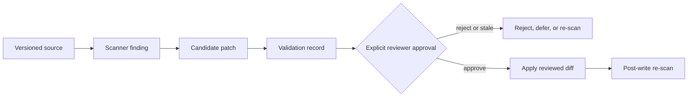

# QUBIT

**Quantum Upgrade Bridge & Inventory Tool** is a local-first research prototype for evidence-bound post-quantum cryptography (PQC) migration. It inventories cryptographic use, records migration tasks, produces candidate source changes, requires explicit human approval before applying a change, and preserves validation and post-write re-scan evidence.

> QUBIT is a research workbench, not a production migration service and not an autonomous cryptographic replacement system. A lower scanner count is not a proof of semantic correctness or cryptographic safety.

## What it does


```mermaid
flowchart LR
    A[Versioned source] --> B[Scanner finding]
    B --> C[Candidate patch]
    C --> D[Validation record]
    D --> E{Explicit reviewer approval}
    E -- reject or stale --> F[Reject, defer, or re-scan]
    E -- approve --> G[Apply reviewed diff]
    G --> H[Post-write re-scan]
```

The important boundary is between generating a candidate and changing source. A candidate remains untrusted until applicable validation completes and a reviewer approves it. A same-file write that makes later source evidence stale is deferred or uniquely re-anchored; it is never silently applied to an obsolete location.

## Current release evidence

The following are release-validation results, not population-level accuracy claims:

| Check | Verified result | Scope |
|---|---:|---|
| Targeted regression suite | 98 passed in 69.47 s; 2 dependency warnings | migration, task, stale-evidence, API, and safety contracts |
| Dashboard lint and production build | passed | frontend quality and bundle generation |
| Windows desktop packaging | passed | Tauri Windows release build |
| Desktop smoke workflow | passed | API startup, scan, task reopening, blocked unapproved apply, and clean shutdown |
| Four-repository desktop re-scan | 4 of 4 completed; 0 parse failures | fixed supplied corpus |
| Scanner emissions in that record | 92 to 86 after 6 reviewed edits | scanner-removal observation only |
| Safety outcomes in that record | 9 proposals rejected; 2 stale Inkwell tasks unapplied | human-governed refusal and deferral behaviour |

Three Inkwell Ruby edits reached the available behavioural oracle. The other applied edits have scanner and syntax evidence only; this is deliberately not represented as full-suite or semantic-correctness proof.

The detailed evidence, limitations, commands, and improvement plan are in [the project validation report](qubit-v2/data/QUBIT_PROJECT_VALIDATION_REPORT.md).

## Architecture

| Layer | Main technology | Responsibility |
|---|---|---|
| Desktop shell | Tauri 2 / Rust | starts, supervises, and shuts down the local service |
| Operator UI | React 19, TypeScript, Vite, Tailwind CSS, TanStack, Zustand, Plotly | scan records, task review, validation evidence, and diffs |
| Local service | Python, FastAPI, Pydantic, SQLAlchemy, Alembic, SQLite | project, scan, task, validation, and migration APIs |
| Discovery | tree-sitter and a rule catalogue | source-aware crypto findings and locations |
| Migration | deterministic codemods, task state machine, re-anchoring | candidate generation and approval-gated source writes |
| Validation | parser, symbol, compile, behavioural, test, and re-scan gates where applicable | explicit evidence record per candidate |
| Risk support | Mosca timeline, QARS integration, heuristic sensitivity, HNDL Bayesian network | explainable prioritisation support |

Docker and Ollama extend the local workflow but are not required for basic scanning and inventory. External source processing is disabled by default.

## Language and digital-twin evaluation scope

The fixed multi-language desktop workflow was exercised on four deliberately vulnerable, self-authored digital twins of real-world application domains:

| Twin | Domain | Language / stack | Offline test evidence |
|---|---|---|---|
| MediVault EMR | electronic medical records | Python / FastAPI | 96 pytest tests; 14 planned findings; 14 of 14 mutation outcomes predicted |
| Inkwell eSign | electronic signatures | Ruby 3.3 | 25 tests / 50 assertions; 14 of 14 mutation outcomes predicted |
| Sentinel IdP | identity and SSO | Go 1.23 | 23 subtests; 15 of 15 mutation outcomes predicted |
| Paymesh Gateway | payment orchestration | Java 21 / Spring Boot | 22 JUnit tests; 13 of 13 mutation outcomes predicted |

These twins model real-world constraints such as persisted values, remote protocol parties, identity state, and payment records while retaining pre-registered ground truth and offline test oracles. They are controlled research fixtures, not live production services and not a statistically representative industrial corpus. Support means QUBIT can execute the recorded workflow on the tested rule surfaces; it does not imply whole-language semantic analysis or coverage of every cryptographic library API.

## Model and automation posture

QUBIT uses deterministic transformations first. A local Ollama path can invoke `qwen2.5-coder:7b-instruct-q4_K_M` where an applicable deterministic transform does not exist. An optional OpenAI-compatible provider can be configured by an operator, but its output remains an untrusted candidate and external processing stays off by default.

The release also contains optional analytical or experimental components:

- The QARS risk score is an adopted analytical model, not a novel QUBIT model.
- The HNDL Bayesian network uses expert-specified conditional probabilities; it is not trained on observed incidents.
- The optional DistilBERT sensitivity harness uses synthetic/template data and is not a default inference path.
- The optional XGBoost regressor approximates the analytical pipeline; it must not be presented as externally validated risk-prediction accuracy.

Observed local-model routing in a recorded 10-finding pilot produced 8 patches (5 deterministic and 3 local-model); all reached evidence level 2 only. Recorded local calls took approximately one to two minutes on the test hardware. These are configuration-specific observations, not a general model-quality, throughput, or accuracy benchmark.

## Getting started

Prerequisites: Python 3.12 or 3.13, [uv](https://docs.astral.sh/uv/), Node.js for the dashboard, and the Rust toolchain for desktop builds.

```powershell
uv sync --all-packages
uv run poe unit

cd dashboard
npm ci
npm run build
```

To build the Windows desktop application, use the dashboard's documented Tauri release command after the Python environment and dashboard dependencies are installed. Optional Docker validation images and Ollama are opt-in and should be installed only when that workflow is needed.

## Reproducibility and responsible use

For a research result, retain the repository revision, OS/toolchain versions, rule and generator configuration, task-state export, validation JSON, applied-diff hashes, post-write scan, and command output. Do not send sensitive repositories to an external provider without explicit organisational approval and a source-transfer policy.

Before a publication claim, distinguish clearly between current release validation, controlled self-authored digital-twin results, historical campaigns, and planned future studies. The project documentation intentionally reports rejected, deferred, and unavailable-validation outcomes alongside successes.

## Open-source contribution guide

QUBIT welcomes contributions that make the tool safer, more reproducible, easier to evaluate, or easier to use. Particularly valuable areas are:

- rule and fixture coverage for supported languages and configuration formats;
- validation harnesses, especially maintained Go and Java behavioural coverage;
- accessibility, Windows desktop lifecycle, and operator-experience improvements;
- reproducible evaluation artefacts, independent labels, and documentation corrections; and
- security review of local-first workflows and source-handling boundaries.

Start with [CONTRIBUTING.md](CONTRIBUTING.md). It explains local setup, the expected test evidence, the extra requirements for scanner rules and migration transforms, and the pull-request process. Please read the [Code of Conduct](CODE_OF_CONDUCT.md), use [Security reporting guidance](SECURITY.md) for vulnerabilities, and open an issue before investing in a large change.

Contributions do not need to be code. Clear issue reports, test cases that demonstrate a failure, documentation fixes, UI accessibility feedback, independent evaluation designs, and careful review of research claims are all first-class contributions.

## Roadmap and non-goals

Near-term priorities are stronger cross-language behavioural evidence, an exportable per-run evidence package, cross-finding ownership analysis, measured desktop cold-start performance, and an independently labelled benchmark. QUBIT does not claim to replace a security architecture review, cryptographic engineering review, vendor support policy, or organisational PQC governance programme.

## License

MIT. See [LICENSE](LICENSE) and [THIRD_PARTY_NOTICES.md](THIRD_PARTY_NOTICES.md).
