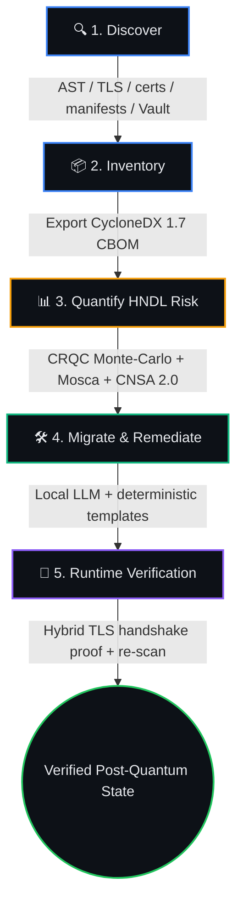

<div align="center">
  <h1>QUBIT</h1>
  <p><b>Quantum Upgrade Bridge &amp; Inventory Tool</b></p>
  <p><i>Harvest-Now-Decrypt-Later (HNDL) Risk Modeling &amp; Automated Post-Quantum Cryptographic Migration</i></p>

  
  
  
  
  
  
</div>

---

## 📖 Overview & The Post-Quantum Threat

As Cryptographically Relevant Quantum Computers (CRQCs) approach maturity, existing public-key cryptography (such as RSA and ECC) faces an existential threat from Shor's algorithm. For sensitive data, the threat is not years away; it is happening today through **Harvest-Now-Decrypt-Later (HNDL)** attacks. Adversaries are actively intercepting and storing encrypted traffic today with the explicit intent to decrypt it once quantum hardware is available.

**QUBIT** is an open-source platform engineered to automatically discover, quantify, and remediate this risk. It provides an end-to-end pipeline to transition codebases and infrastructure to NIST-standardized Post-Quantum Cryptography (PQC), specifically **ML-KEM** (FIPS 203) and **ML-DSA** (FIPS 204).

QUBIT operates **fully offline** with no telemetry, leverages a **local LLM** (Ollama) for code transformation so source never leaves the machine, and emits standards-compliant **CycloneDX 1.7 Cryptographic Bill of Materials (CBOM)** artifacts.

> **Honest status.** QUBIT is production-*grade* (real scanning, typed, 817 tests passing with zero skips, CI, git-safe DB migrations, a live hybrid-PQC TLS bridge) but not yet production-*hardened* — see [Project status](#-project-status) for exactly what is and isn't done.

---

## 🚀 The End-to-End Pipeline


```mermaid
graph TD
    A[🔍 1. Discover] -->|AST / TLS / certs / manifests / Vault| B[📦 2. Inventory]
    B -->|Export CycloneDX 1.7 CBOM| C[📊 3. Quantify HNDL Risk]
    C -->|CRQC Monte-Carlo + Mosca + CNSA 2.0| D[🛠️ 4. Migrate &amp; Remediate]
    D -->|Local LLM + deterministic templates| E[🌉 5. Runtime Verification]
    E -->|Hybrid TLS handshake proof + re-scan| F((Verified Post-Quantum State))

    style A fill:#0d1117,stroke:#3b82f6,color:#e5e7eb,stroke-width:2px
    style B fill:#0d1117,stroke:#3b82f6,color:#e5e7eb,stroke-width:2px
    style C fill:#0d1117,stroke:#f59e0b,color:#e5e7eb,stroke-width:2px
    style D fill:#0d1117,stroke:#10b981,color:#e5e7eb,stroke-width:2px
    style E fill:#0d1117,stroke:#8b5cf6,color:#e5e7eb,stroke-width:2px
    style F fill:#0d1117,stroke:#22c55e,color:#e5e7eb,stroke-width:2px
```

### 1. Discovery & Enumeration
Five independent scanner sources, all real:

| Source | What it does |
|---|---|
| **Code (AST)** | `tree-sitter` parsing driven by a data-only `qubit-rule/v1` YAML catalog — **152 rules across Python (39), Go (30), Java (21), JavaScript (25), TypeScript (25), C/C++ (12)**, covering key generation *and use* (sign/verify/encrypt/decrypt), symmetric ciphers, hashes, MACs, KDFs, JWT/JOSE, WebCrypto, OpenSSL EVP, TLS configuration, and the most-installed third-party crypto libraries. Every rule ships its own positive/negative fixtures, executed as tests. |
| **Config** | **nginx, Apache httpd/mod_ssl, and OpenSSH** `sshd_config`/`ssh_config` — protocol versions, cipher suites, MACs, **key-exchange groups** (`ssl_ecdh_curve`, `SSLECDHCurve`, `SSLOpenSSLConfCmd Curves`) and host-key algorithms. Cipher-suite names resolve in **both** spellings — IANA `TLS_..._WITH_...` and the OpenSSL form real configs actually contain (`ECDHE-RSA-AES128-SHA`) — each reducing to the component that governs HNDL risk, with a prefix-less suite correctly read as static RSA key transport. OpenSSH vendor suffixes, DH group numbers, and the PQC hybrid KEX (`sntrup761x25519-sha512@openssh.com`) all resolve to real algorithms and sizes; a bare curve in a key-exchange list is reported as ECDH, not as a signature. |
| **Network TLS** | Live handshake enumeration, plus a **raw-ClientHello PQC-group probe** that detects `X25519MLKEM768` / `SecP256r1MLKEM768` / `SecP384r1MLKEM1024` support with no OpenSSL dependency and no key generation (RFC 8446 HelloRetryRequest technique). |
| **Certificates & keys** | X.509 PEM/DER parsing → public-key algorithm, key size, signature algorithm. |
| **Dependencies (SCA)** | `go.mod` / `package.json` / `requirements.txt` / `pyproject.toml` / `pom.xml` → a curated library→algorithm map (14 packages across 4 ecosystems), with **version-aware capability gates** so a library too old to have PQC is never credited with it. |
| **HashiCorp Vault** *(opt-in)* | Polls `transit` keys and `pki` certificates over Vault's HTTP API, including its `ml-dsa` / `slh-dsa` / `hybrid` key types. |

### 2. CycloneDX 1.7 Inventory
Findings normalize into the frozen `CryptoAsset` schema against a canonical registry of **120 algorithms** (RSA/ECDSA/EdDSA/AES/SHA families, the JOSE-JWT `RS*`/`PS*`/`ES*`/`HS*`/`EdDSA` identifiers, ML-KEM, ML-DSA, SLH-DSA, and hybrid TLS groups). The DB is the source of truth; the CBOM is the exportable compliance artifact, validated against the official ECMA-424 schema.

### 3. HNDL Risk Quantification
A **Monte-Carlo simulation** of CRQC arrival blended with an expert-survey prior, a Bayesian network for HNDL exposure, a sensitivity classifier (PII/PHI/financial/credentials), an XGBoost regressor with split-conformal confidence intervals, and **Mosca's Inequality** (`margin = Z − (X + Y)`). A separate **CNSA 2.0 milestone evaluator** scores an inventory against NSA's regulatory deadlines (2025 → 2035) — a deterministic deadline source alongside the probabilistic one.

### 4. Automated Migration
A dependency graph plus WSJF prioritization feeds a 12-state FSM. **14 transform rules** cover every asset class QUBIT discovers — web-server and OpenSSH configuration, dependency manifests, and code across Python/Go/C/JS/TS/Java — each declaring its target, its `data_compat` hazard (`in_place` / `dual_read` / `reencrypt_required`), and a worked example that doubles as few-shot prompt content. Coverage is measured rather than asserted: a guard test sweeps **every detection rule's own positive examples** and requires that every vulnerable asset the scanner can produce has a transform rule that matches it — currently **100%** (it was 31% before this was measured). The classes deliberately excluded are the ones no code patch can fix, each with the operational action it needs instead: certificate reissue, HSM/Vault key rotation, and live-endpoint findings that are remediated by hardening the server's own config.

The division of labour between deterministic codemods and the **local, sandboxed LLM** is explicit rather than incidental. Where the correct output is a *constant* — `ssl_ecdh_curve X25519MLKEM768`, `KexAlgorithms sntrup761x25519-sha512@openssh.com`, a dependency version floor — the codemod is marked `codemod_authoritative` and an LLM never replaces it, even when one is explicitly requested: a 7B model asked to harden an nginx.conf produced a config that *looked* modern (TLS 1.2+1.3, AEAD suites) while silently omitting the hybrid group, which is the one line that actually makes the deployment quantum-safe. The LLM is used where the transform needs judgement about surrounding code (key lengths, nonce handling, call-site changes), behind a repair loop that feeds rejections back for up to 3 attempts and a preservation guard that refuses a rewrite which drops unrelated code or fails to parse.

Because remediation output is also scanner *input*, hardened files are re-scanned and asserted on: the algorithms the codemods write must resolve in the canonical registry and must be rated quantum-safe, so a migration can prove where it landed instead of reporting its own output as `UNKNOWN`. A versioned migration knowledge base (`migration_kb.yaml`) and crypto-agility policy decide each target. Governance gates require sign-off before a patch can be applied.

### 4b. Reports — one format per audience

Chosen from what security teams actually consume, not from what was easiest to emit. `qubit report <path> -f pdf|sarif|json`:

| Format | Audience | Why this one |
|---|---|---|
| **SARIF 2.1.0** | AppSec / SOC analysts | An [OASIS standard](https://docs.github.com/en/code-security/concepts/code-scanning/sarif-files). Upload with `github/codeql-action/upload-sarif@v3` and each finding becomes a code-scanning alert **annotated on the offending line**; VS Code and Azure DevOps read the same schema. QUBIT's stable asset fingerprint is passed through as `partialFingerprints`, which is how GitHub keeps an alert identical across commits instead of closing and reopening it whenever code shifts above the finding. `error` is reserved for Shor-breakable public key — the only class whose compromise is retroactive. |
| **PDF** | Compliance, audit, leadership | [EO 14412](https://www.qusecure.com/pqc-migration-executive-orders/) (June 2026) and OMB M-26-15 make cryptographic inventory a *reporting* obligation with fixed dates, and what gets filed and archived is a paginated document. The report states posture against those deadlines — high-value assets on PQC key establishment by 2030-12-31 — rather than only printing scores. Rendered with `reportlab` (pure Python, no system libraries), so it works fully offline. |
| **CycloneDX 1.7 CBOM** | Supply-chain tooling, agency inventory | The machine format the regulations actually **name** (ECMA-424). Already available via `qubit cbom export`, byte-reproducible with `--reproducible`. |
| **JSON** | SIEM / spreadsheets | The raw risk-annotated inventory. |

The dashboard's Report page composes the same data on screen, with a standalone HTML export and a print stylesheet for browser print-to-PDF.

### 5. Verification & Hybrid TLS Bridge
No patch is trusted blindly: every patch is validated in a Docker sandbox and proven by re-scan. The bridge stands up a **hybrid PQC TLS terminator** on native **OpenSSL 3.5+** negotiating `X25519MLKEM768`, then swaps classical→hybrid **on the same port** and verifies the negotiated group.

---

## 🏗️ Architecture & Monorepo Structure

A Python monorepo managed by `uv`. Packages communicate strictly through `qubit-core` models, the database, and the REST API — no private cross-package imports (enforced in CI).

| Module | Role & Core Technologies |
|---|---|
| 📦 **`qubit-core`** | **Source of truth.** Frozen `CryptoAsset` Pydantic + SQLAlchemy models, the canonical algorithm registry, Alembic migrations (applied automatically at startup), fingerprinting, evidence redaction, CBOM export/import. |
| 🔍 **`qubit-scanner`** | **Discovery engine.** The five sources above, plus deterministic normalization and dedup. |
| 📊 **`qubit-risk`** | **HNDL engine.** CRQC Monte-Carlo timeline, Bayesian network, sensitivity classifier, XGBoost regressor, Mosca margin, CNSA 2.0 policy. All parameters live in versioned YAML with a reproducibility hash. |
| 🛠️ **`qubit-migrate`** | **Orchestrator.** Dependency graph, WSJF queue, FSM, LLM + template transforms (prompt-injection hardened), IaC patches, migration KB, agility + governance policy. |
| 🌉 **`qubit-bridge`** | **Runtime validation.** Hybrid TLS terminator images, `openssl s_client` probe/verify, capture/diff, same-port classical↔hybrid swap. |
| 🔌 **`qubit-api`** | **Control plane.** FastAPI normative REST registry, `JobRunner` with crash recovery, SSE progress, and **real bearer-token auth** (DB-backed, sha256-hashed, `ro`/`rw` scopes, revocable). |
| 💻 **`qubit-cli`** | **Typer CLI.** The `qubit` entrypoint — scan, risk, migrate, bridge, cbom, demo, serve, tokens, rules. |
| 🎨 **`dashboard`** | **UI.** React 19 + Vite 8 + TailwindCSS v4 + Plotly, shipped both as a web app and as a **native Windows desktop app** (Tauri 2 — see [docs/DESKTOP_APP.md](docs/DESKTOP_APP.md)). |

---

## ⚙️ Quick Start

### Prerequisites
- **Python 3.12 or 3.13** (`uv` manages the interpreter; 3.14 is not yet supported — `pgmpy`/`torch`)
- **uv** — `winget install --id astral-sh.uv -e`
- **Docker Desktop** — sandbox validation, the hybrid-TLS bridge, and integration tests
- **Node.js 22+** — only to build the dashboard from source
- **Ollama** *(optional)* — LLM-generated patches; deterministic templates work without it
  (`ollama pull qwen2.5-coder:7b-instruct-q4_K_M`)

### Option A — full stack with Docker

```bash
git clone https://github.com/Dharsan2024/QUBIT-Quantum-Upgrade-Bridge-Inventory-Tool.git
cd QUBIT-Quantum-Upgrade-Bridge-Inventory-Tool

docker compose up
```

- Dashboard: **<http://localhost:8080>**
- API: same origin under **`/api/v1`** (the dashboard's nginx reverse-proxies it; the API container is
  deliberately not published to the host)
- Default bootstrap token: `dev_token` — override with `QUBIT_API_TOKEN`. It is honored only while the
  token table is empty and self-disables the moment you mint a real one.

Verified from a clean slate: **~9 seconds** from `docker compose up` to a working authenticated stack.

### Option B — from source

```bash
uv sync --all-packages          # installs every workspace package + dev tooling

uv run qubit scan ./my-project --cbom out.json    # discover + export a CBOM
uv run qubit risk run -p default                  # score HNDL risk
uv run qubit migrate plan -p default              # ranked migration queue
uv run qubit migrate apply --auto-approve         # generate + validate + apply patches
```

> `pip install qubit-cli` is **not yet available** — publishing to PyPI is deferred until after the
> current hardening sprint. Use `uv sync --all-packages` for now.

### The one-command demo

```bash
uv run qubit demo run --all
```

Runs the whole story: capture classical TLS → discover the vulnerable crypto → score HNDL risk →
generate, validate and apply a patch → re-scan to prove remediation → bring up the hybrid bridge on the
same port → verify `X25519MLKEM768` was negotiated. Add `--canned` to run it without Docker.

### Other useful commands

```bash
uv run qubit scan-network example.com --port 443      # live TLS + PQC-group probe
uv run qubit scan-vault http://127.0.0.1:8200 --token <tok>
uv run qubit rules list                               # inspect the detection catalog
uv run qubit serve token create --scopes rw           # mint a real API token
uv run qubit cbom validate out.json                   # validate against CycloneDX 1.7
```

---

## 📊 Project status

Phases 0–2 are complete; the project is in its **Phase 3 hardening sprint** (deadline end of
September 2026). Full detail: [docs/BUILD_PLAN.md](docs/BUILD_PLAN.md) and
[docs/project-status/](docs/project-status/).

**Done and verified:** all five scanner sources · CBOM 1.7 export/import · the full risk engine ·
LLM + template migration with sandbox validation · the hybrid TLS bridge with same-port swap ·
extended modules E1–E5 (migration KB, agility policy, per-asset recommendation, dependency-graph API,
governance gates) · real token auth with scopes · `docker compose up` from a clean slate ·
817 tests passing with **zero skips** · 82% coverage on the three core packages · CI green.

**Still outstanding:** PyPI publication · a structured-logging story · a recorded backup demo video.

> **Optional external tool.** `qubit bridge capture` and the harvest phase of `qubit demo` need
> **tshark** (ships with Wireshark) to record a pcap. Without it QUBIT says so plainly and writes an
> empty file rather than pretending; with it, the demo measures the real on-the-wire cost of
> post-quantum key establishment — a classical server key_share of **32 bytes** against
> **1120 bytes** for X25519MLKEM768. QUBIT finds tshark on PATH, in the standard Wireshark install
> directories, or via `QUBIT_TSHARK`.
The three defects previously tracked in [BUILD_PLAN §Phase 3](docs/BUILD_PLAN.md) are now closed.

### Performance

Measured with `cProfile` and `-X importtime` on a real repository, not estimated:

| Path | Before | After | What was wrong |
|---|---|---|---|
| `qubit` CLI start-up | 1.77 s | **0.75 s** | `scipy.stats`, `alembic` and `libcst` were all imported eagerly — by `qubit scan`, by `qubit --help`, and by every validator subprocess — for code paths none of them touch |
| Repeat `scan_paths()` | 2.17 s | **1.21 s** | the rule catalog re-parsed 29 YAML files and recompiled ~152 tree-sitter queries on *every* call (0.8 s, 37% of a scan), though the pack is static per install |
| Full test suite | 90 s | **77 s** | same catalog caching, which most tests pay for too |
| Patch validation (per patch) | 1.55 s | **1.44 s** | plus it no longer requires `uv` on PATH, and can no longer hang on a nested `uv run` environment lock |

The risk engine turned out to be **already near its floor** — `simulate()` was correctly cached per
algorithm, so 213 assets cost only 5 real Monte-Carlo runs. Its hottest function (`min_distance`,
72% of the pipeline) was rewritten for a modest 1.09x and, more usefully, fewer moving parts; two
faster-looking alternatives were measured, found slower, and are recorded in the code so they are not
retried. Reporting a 9% win as a 5x one would have been the easy mistake here.

---

## 🧪 Research & Evaluation

QUBIT is the basis of a research paper on automated cryptographic agility. The paper and its four
formal experiment suites (scanner precision/recall vs. baselines, risk calibration, LLM patch pass@k,
hybrid-handshake overhead via `tc netem`) are **deliberately deferred** until after the product
hardening deadline so they cannot compete with shipping. See
[docs/RESEARCH_PAPER.md](docs/RESEARCH_PAPER.md).

---

## 🛠️ Developer Guide

```bash
uv sync --all-packages

uv run poe check          # format + lint + typecheck + unit tests
uv run poe unit           # tests that need no Docker/Ollama/network
uv run poe integ          # Docker-backed integration tests

# Dashboard, including real-browser tests of the Report page (needs a running API):
cd dashboard && npm run build && npm run test:e2e
```

Quality bar: **zero test failures, zero skips**, ruff clean, and ≥70% coverage on `qubit-core`,
`qubit-scanner`, and `qubit-risk` (currently 82%).

The dashboard's Report page is verified in a real Chromium via Playwright, against a real
risk-annotated scan seeded through the public API — not mocked. `tsc -b` proves every API field access
matches the declared contract, but only a browser catches a component that throws at mount, a
`median(undefined)` printing NaN, or an export button that downloads an empty file. The suite asserts
the rendered verdict, the CRQC years, the algorithm inventory, and that **Export HTML** produces a
complete self-contained document; renaming one API field in the page makes it fail, which is how the
tests were confirmed to be non-vacuous.

Adding a detection rule needs **no Python** — drop a YAML file in
`packages/qubit-scanner/src/qubit_scanner/catalog/rules/<language>/` with embedded positive/negative
examples, and the test suite picks it up automatically.

Design documents live in [docs/design/](docs/design/) and are the implementable specification behind
every module; start with [00-architecture-frame.md](docs/design/00-architecture-frame.md).

## 📜 License

MIT — see [LICENSE](LICENSE). Third-party projects whose public schemas or data informed specific files
are credited in [THIRD_PARTY_NOTICES.md](THIRD_PARTY_NOTICES.md); benchmark corpora and baseline tools
used in evaluation are run-only and subject to their own upstream licenses.
