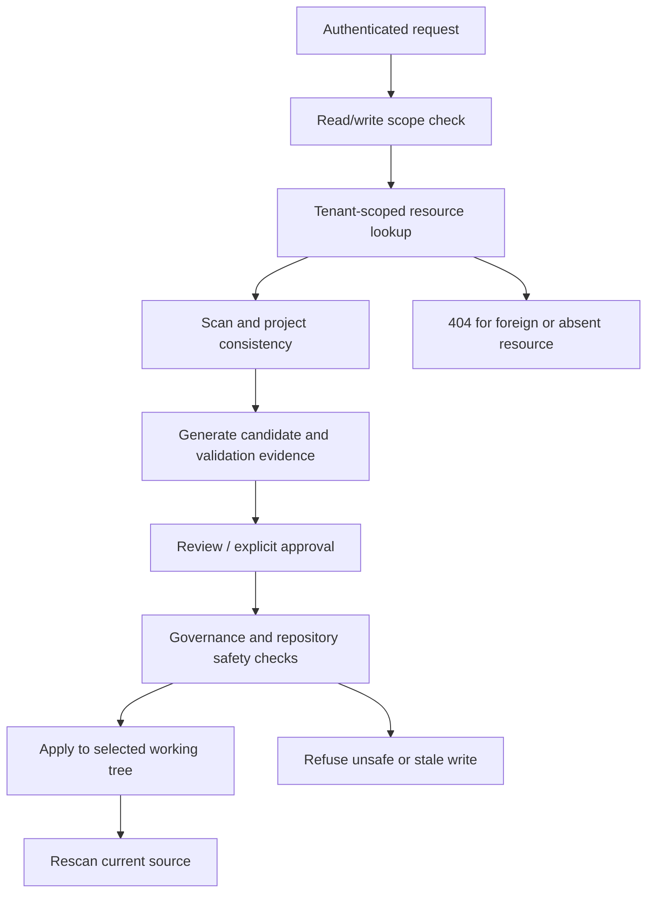
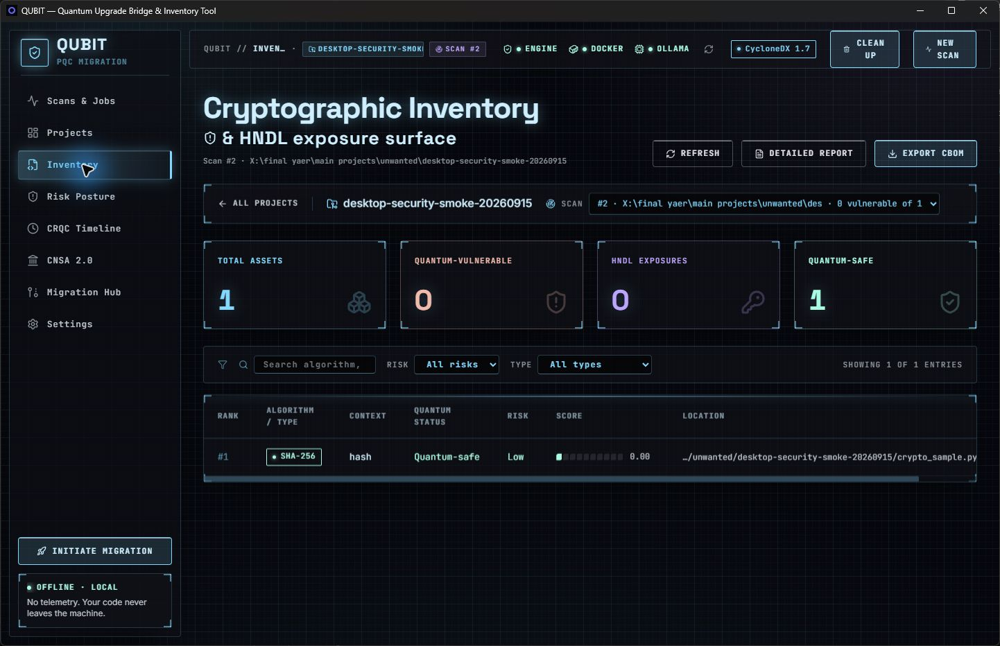

# QUBIT — security remediation and desktop validation

Date: 15 September 2026. This report separates fresh engineering checks from the earlier four-repository research experiment. It is an implementation/validation record, not a claim of universal migration correctness or a security certification.

## 1. Purpose and evaluation boundary

QUBIT is an evidence-preserving, human-governed cryptographic migration workbench: discover cryptographic assets, prioritise risk, prepare candidate changes, expose validation evidence, obtain approval, write within the selected repository, and rescan the resulting source. A generated or scanner-clean patch is not automatically a correct protocol migration.

The work in this revision addresses the supplied review comments, API isolation, concurrency, desktop behaviour, and reproducibility. It does not retrain an ML model or repeat the four digital-twin experiments. The existing paper DOCX was deliberately left untouched so the author can incorporate only the claims supported here.

## 2. Changes and their implications

| Area | Defect or risk | Implemented change | Why it matters |
|---|---|---|---|
| Migration scope | A supplied scan UUID could belong to another tenant or project | Resolve the scan under the authenticated tenant and reject project/scan mismatches before creating or reusing a plan | Prevents cross-tenant references and inconsistent scope |
| Task endpoints | Generate/advice resolved tasks directly by ID | Tenant-scoped task lookup before orchestration | A foreign or nonexistent task returns 404 without invoking generation |
| Patch endpoints | List/review/apply lacked complete ownership checks | Resolve patch ownership through its task and plan before access or filesystem checks | Protects source diffs, reviewer decisions, and writes |
| Learning statistics | Global aggregates leaked other teams' activity | Tenant predicates on cache counts, hits, and outcome aggregation | Statistics describe the requesting team |
| Background jobs | Migration jobs defaulted to the wrong tenant | Copy tenant identity from the authorised plan | Jobs remain visible only to their own team |
| Live job events | Global and per-job event streams could reveal foreign jobs | Validate job ownership at subscription and filter every live/replayed event against stored ownership | REST and SSE share the tenant boundary; unknown events fail closed |
| Shared providers | Team tokens could administer singleton provider resources | Restrict shared provider/pool/budget and threat-intelligence routes to the default operator tenant; retain read-only/write scope checks | Ordinary tenants cannot reconfigure shared credentials or inspect global budgets |
| Desktop credential | Launcher replaced an explicitly configured API token with the public development token | Preserve the configured token; only use the development fallback when absent | Desktop launch no longer silently weakens configured authentication |
| Key creation | A losing process could read a newly created but incomplete Fernet key | Write/fsync a same-directory temporary file, atomically publish it without overwriting a winner, then clean up the temporary file | Concurrent first use converges on one complete key |
| SQLite upgrade/downgrade | Foreign-key PRAGMA toggles inside a transaction were ineffective | Toggle outside the migration transaction; use an explicit atomic rebuild, foreign-key check, rollback on failure, and restore prior enforcement | Populated scans/jobs survive table rebuilding; an incompatible downgrade does not partially destroy the schema |
| Progress updates | The retry wrapped a no-op rather than the commit | Retry the complete load/update/commit and reapply values after rollback | Temporary lock contention no longer drops an otherwise retryable update |
| Bridge inventory | Vulnerable assets could be accompanied by a zero dashboard count | Store vulnerable count with the new bridge scan | Summary statistics match ingested findings |
| Cipher metadata | GCM-SIV was reported as GCM; CBC-MAC as CBC | Recognise compound modes first and exclude MAC constructions | Mode-specific weakness metadata is more faithful |
| Secret fixture | A committed provider-key-shaped literal triggered an alert | Replace it with an explicitly synthetic value constructed at runtime | Removes the literal from the current source without disabling detection |
| Logging tests | Named-logger state leaked between tests | Restore handlers, levels, filters, disabled flags, propagation, root state and global disable threshold | Reduces order-dependent test behaviour |
| Optional corpus | Missing Sonar corpus caused a misleading zero-file scan and IndexError | Fail before scanning with an actionable missing-corpus message | No fabricated zero-file agreement result |
| Evaluation script | Developer-specific path and broad process termination | Resolve checkout from the script/parameter; check prerequisites/ports; stop only the launched process tree; restore environment; fail on incomplete runs | Safer portability and clearer failures |
| Evaluation evidence | Reruns targeted historical paper-output filenames | Put new harness output under test-output/desktop-evaluation | Historical research evidence is not overwritten by a normal rerun |
| Governance UI | Frontend names disagreed with the API, leaving counts/status blank | Align the TypeScript response and renderer with status/current/required; display sensitivity from the task | Reviewers can see the actual approval gate |
| Effort explanation | Non-KEM transformations were labelled KEM semantic changes | Use a generic transformation label outside key-exchange rules, without changing scores | Avoids describing an MD5 hash upgrade as a KEM migration |
| Privacy wording | Sidebar promised code could never leave the machine despite optional external processing | State the explicit opt-in boundary | UI wording no longer overstates offline guarantees |
| Test assumptions and CI | External routing tests omitted the required source-transfer opt-in; existing lint/format drift | Make permission explicit in simulated routing scenarios, preserve default-deny tests, repair static checks and formatting | Tests exercise the intended configuration without weakening production privacy |

## 3. Workflow and security boundary



Shared installation configuration has an additional operator-tenant boundary. SSE event ownership is checked for both fresh events and Last-Event-ID replay. These controls do not provide operating-system isolation between people who already have access to the same files.

## 4. Fresh desktop smoke experiment

The native Windows UI was used to scan a disposable Git repository containing one synthetic Python function calling `hashlib.md5`. It was kept separate from the supplied digital twins and from the QUBIT source tree's own Git history.

Observed sequence: scan succeeded → inventory showed one MD5 finding → migration plan offered `py-weakhash-01` → deterministic generation produced an MD5-to-SHA-256 diff → the reviewer approved that diff → Initiate Migration wrote one change → the app offered a post-apply rescan.

The candidate evidence displayed passes for applies, parses, symbols, compiles, behaves and rescan. The behavioural stage reported three relations: hash determinism, digest length, and distinct inputs. The project test stage was explicitly skipped because this intentionally minimal fixture has no suite. The UI labelled the candidate **partly validated**. This is useful behavioural evidence for a hash fixture, not proof of application compatibility: SHA-256 changes the output and may break a consumer that requires MD5.

The post-apply desktop rescan completed successfully: one SHA-256 asset, zero vulnerable findings, and zero HNDL findings. The source diff contains exactly the MD5-to-SHA-256 substitution. After rebuilding, the release executable was launched explicitly and loaded the existing project with both successful scans. The earlier installed executable is a different build and was not overwritten; use the rebuilt executable or installer for these changes.

The rebuilt task view displayed populated approval counts and the applied patch's validation record. The gate is a current eligibility check, not an approval-history total: an already applied candidate is no longer counted as pending approved, so the completed task can show `0 / 1` and blocked. Historical effort explanations also remain stored with the original plan; the corrected effort label affects newly built plans. These presentation limitations should not be mistaken for a missing applied diff or failed rescan.



## 5. Fresh validation ledger

Initial broad offline run: 3,242 passed, five failed, one skipped (3,248 collected outcomes), JUnit elapsed 809.850 seconds. The five failures reproduced in external-routing tests and were traced to missing explicit opt-in in the test setup, not permission being granted by the product. The corrected routing/default-deny checks passed: **47 tests in 78.27 seconds**.

Focused API/workflow and tooling run: **53 passed in 34.43 seconds**, with two dependency deprecation warnings. Atomic key creation, populated migration round-trip/failure rollback, and progress retry checks passed in an earlier focused run: **6 tests in 4.01 seconds**. These runs overlap the broad suite and must not be added together as independent test counts.

Rust desktop credential tests: **2 passed**, zero failed. Frontend lint and production builds passed; Windows NSIS packaging succeeded. The production build still warns about the large lazy-loaded Plotly chunk; successful packaging is not a startup-latency measurement.

Final broad offline run: **3,247 passed, one skipped, zero failures/errors; 3,248 outcomes in 798.818 seconds** (JUnit elapsed). An additional focused check after the effort-label/static-check changes passed **24 tests in 8.62 seconds**. These are overlapping checks, not additive experiment samples. Repository-wide Ruff checks passed and all 419 checked files passed formatting verification. The rebuilt Windows desktop loaded the smoke-test project successfully.

### Reproduction commands

Run from the repository root after installing the documented workspace dependencies:

```powershell
uv run pytest -m 'not integration and not llm and not online' -n 4 --tb=short -q --junitxml=test-output/security-review.xml
uv run ruff check .
uv run ruff format --check .
cargo test --manifest-path dashboard/src-tauri/Cargo.toml
cd dashboard
npm run lint
npm run tauri:build
```

The recorded local runs used `.venv\Scripts\python.exe -m pytest` and `.venv\Scripts\ruff.exe` directly. Python 3.12.13, Node 24.18.0 and Cargo 1.97.1 were observed on Windows. Rustfmt was installed to format the Rust change. Early sandboxed attempts failed due to temporary-directory permissions; those failed setups are not counted as successful tests. Parallel tests and compilation shared the machine, so elapsed test times here are not application/model efficiency benchmarks.

## 6. What to add to the research paper

### Engineering contribution

Describe tenant-scoped source-change authority, consistent scan/project scope, refusal before side effects, auditable validation stages, rollback-safe persistence, and post-apply rescanning. Present these as implemented workbench controls demonstrated on bounded tests, not as cryptographic novelty or proof that generated migrations are generally correct.

### New results paragraph

“The implementation was additionally evaluated through negative API-isolation tests, concurrency and database-upgrade regressions, and a native Windows smoke workflow. Foreign task and patch identifiers were rejected before generation or source mutation. Concurrent encryption-key creation and populated SQLite schema rebuilding were exercised, including failed-downgrade rollback. A disposable Python hash fixture completed candidate generation and explicit approval through the desktop; unavailable project-suite validation remained visible as skipped rather than being reported as passed.”

Use the final ledger counts and desktop rescan result above, and identify the published remediation commit with `git log -1`. Do not call these data a second four-repository trial.

### Preserve the earlier experiment as a separate table

The previously supplied research record is four self-authored digital twins representing realistic application domains, one repository per language; four desktop re-scans with zero parse failures; scanner findings 92 → 86 after six reviewed edits; nine unsafe proposals rejected; two stale tasks left unapplied; and three Inkwell edits reaching a Ruby behavioural oracle. The other applied edits did not receive full-suite proof. Those are prior outcomes supplied for the paper, **not rerun or independently re-established by this remediation exercise**.

Call the repositories author-built digital twins/testbeds, not independently sampled production systems or live customer deployments. Explain their intended real-world application patterns and their construction limitations. The previous 98-test release gate is a dated, narrower baseline, not the test count for this revision.

### Metrics that remain unmeasured

No new model accuracy, precision/recall, inference throughput, token/cost saving, stochastic success rate, cold-start improvement, or industrial generalisation estimate was measured here. Effort hours are rule-based estimates, not observed developer labour. An ML efficiency claim needs repeated controlled trials, model/version/configuration, hardware, input distribution, per-attempt tokens/latency, failures, and uncertainty intervals.

## 7. Residual risks and next work

1. **Credential alert:** if the historical literal was a provider-issued key, revoke/rotate it at the provider and inspect usage. No live-key validation or provider revocation was attempted. Current-tree removal does not erase Git history or establish that the GitHub alert is resolved. No history rewrite or alert suppression was performed.
2. **Deployment:** the default tenant is a trusted installation operator; there is no separate enterprise administrator role. Bind local use to loopback. Remote deployments need a unique token, authenticated TLS, network controls, and appropriate filesystem/process isolation.
3. **Evidence scope:** the native smoke fixture is small and self-authored. No four-twin full-suite rerun, independent labelling, model ablation, or repeated stochastic trial is claimed.
4. **Optional checks:** the broad suite excludes integration, online and live-LLM markers. A SQL PQC-target coverage case is skipped because that language's emitted asset families have no corresponding PQC migration target. Do not describe this as “all possible tests passed.”
5. **Cryptographic compatibility:** scanner disappearance, syntax checks and a small behavioural oracle do not prove consumer/protocol compatibility, deployed security, or NIST-algorithm interoperability.
6. **Release follow-through:** re-run CI on the pushed commit and request a fresh independent review. This local remediation does not constitute a Copilot approval or penetration-test certification.

## 8. Artifact handling

Only source, regression tests, contributor-facing documentation, and this report are intended for Git. Local test databases, logs, JUnit outputs, disposable repositories, installers, caches and the author's modified paper are not release-source changes. Existing research evidence and the four supplied repositories were not moved, deleted, or rewritten as part of this work.

### Local evidence fingerprints (SHA-256)

Source base before remediation: `6177b68`. The disposable fixture baseline is `52eb3b4`; its only applied source edit replaces `hashlib.md5` with `hashlib.sha256`.

| Artifact | SHA-256 |
|---|---|
| Final offline JUnit XML (`unwanted/security-review-final-20260915.xml`) | `AD7423DCC521DDFCE25B6205039DC7F577C263335F62FF37C643DC398D6C9F9E` |
| Applied fixture (`unwanted/desktop-security-smoke-20260915/crypto_sample.py`) | `A1872E28044507F3B10B1615C1E45B0A3689F3ADA27DCE9FE9381E47653F4F90` |
| Rebuilt Windows executable (`dashboard/src-tauri/target/release/qubit-desktop.exe`) | `767BA445624B6CBCE3C7BAD569F082A2A538062343825C59CFFE0C0418C1D367` |

The screenshot is included as bounded report evidence; runtime logs and binaries remain local. These hashes identify local artifacts, not independently reproduced results.
