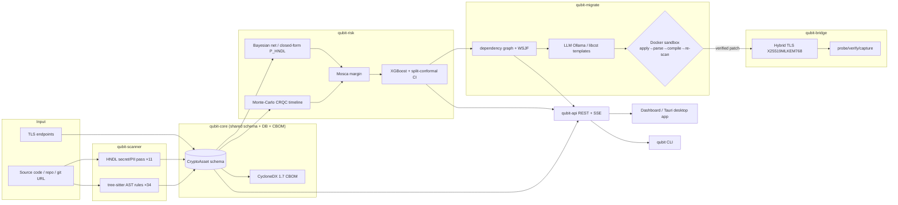

# QUBIT — Paper Authoring Kit (hand this to your co-author)

**Purpose.** Everything needed to write the paper: full technology stack with versions, the novelty
claim positioned against related work, every table and figure spelled out with real data, the
architecture diagram, measured efficiency/test numbers, and a reference list. Companion to
`RESEARCH_PAPER.md` (the manuscript draft) and `qubit-research-paper.html` (styled reading copy).

**Ground truth:** all numbers measured from the repository at commit `7de4756`. Claim tags:
**[M]** measured · **[Mod]** modeled (deliberate simulation) · **[F]** future work (not yet run).
**Do not present [Mod]/[F] as measured empirical results.**

---

## 1. Technologies used (complete, with versions) — TABLE 1

Use as the paper's "Implementation / Tech Stack" table. Versions are the pinned floors in the repo.

### 1.1 Core platform / languages
| Layer | Technology | Version | Role in QUBIT |
|---|---|---|---|
| Language | Python | 3.12 (pinned <3.14) | All 7 backend packages |
| Language | TypeScript | ~5.6 | Dashboard |
| Pkg/build | uv (Astral) | 0.10.x | Monorepo workspace, lockfile, reproducible env |
| Lint/format | Ruff | ≥0.8 | Lint + format gate |
| Types | mypy | ≥1.13 | Static typing gate (qubit-core strict) |
| Tests | pytest (+xdist, hypothesis) | ≥8 | 252 test functions → 331 collected cases |
| CI | GitHub Actions | — | ruff + format + per-pkg mypy + pytest + dashboard build |

### 1.2 Discovery (`qubit-scanner`)
| Technology | Version | Role |
|---|---|---|
| tree-sitter | ≥0.24, **<0.26** | AST parsing of source (Python/Java/Go) |
| tree-sitter-language-pack | ≥1.12 | Grammar bundle |
| pathspec | — | .gitignore-style file filtering |
| (stdlib `re`) | — | HNDL secret/PII pattern pass (11 patterns) |

> **Cite this as an engineering finding:** tree-sitter 0.26.0's binding SIGSEGVs during query
> processing; QUBIT pins `>=0.24,<0.26` with a regression test — a real robustness fix worth a
> sentence in the paper. **[M]**

### 1.3 Risk engine (`qubit-risk`)
| Technology | Version | Role |
|---|---|---|
| NumPy | ≥2.0 | Monte-Carlo CRQC simulation vectors |
| SciPy | ≥1.13 | Distributions, Gauss-Legendre integration |
| pgmpy | ≥1.0 | 5-node Bayesian network (HNDL exposure) |
| XGBoost | ≥2.0 | Distillation regressor (calibrated risk score) |
| scikit-learn | ≥1.4 | Split-conformal prediction, metrics |
| (transformers, torch) | ≥4.44 / ≥2.2 | DistilBERT tier — **documented negative result**, opt-in |

### 1.4 Migration (`qubit-migrate`)
| Technology | Version | Role |
|---|---|---|
| networkx | ≥3.3 | Dependency graph, SCC condensation, topo order |
| libcst | ≥1.4 | Deterministic Python codemods (template transforms) |
| Ollama (local LLM) | qwen2.5-coder:7b | LLM patch generation (offline) |
| Docker | 29.x | Network-disabled sandbox for patch validation |

### 1.5 Bridge (`qubit-bridge`)
| Technology | Version | Role |
|---|---|---|
| OpenSSL | 3.5.x | Native ML-KEM/ML-DSA; negotiates X25519MLKEM768 |
| nginx (hybrid image) | 1.31 | Hybrid TLS terminator |
| tshark/tcpdump (optional) | — | Handshake pcap capture |

### 1.6 Platform + UI (`qubit-api`, `qubit-cli`, dashboard, desktop)
| Technology | Version | Role |
|---|---|---|
| FastAPI | ≥0.139 | REST API |
| Pydantic (v2) | ≥2.7 | Schemas/validation (frozen `CryptoAsset`) |
| SQLAlchemy | ≥2.0.30 | ORM (SQLite default, Postgres optional) |
| Alembic | ≥1.18 | Schema migrations |
| uvicorn | ≥0.35 | ASGI server |
| sse-starlette | ~3.4 | Server-Sent Events (live job progress) |
| Typer + Rich | ≥0.12 | CLI |
| cyclonedx-python-lib | ≥11.11 | CycloneDX 1.7 CBOM export |
| React | 18/19 | Dashboard |
| Vite | 8.x | Frontend build |
| TanStack Query + Table | 5.x / 8.x | Server state + inventory table |
| Plotly.js | 3.x | CRQC timeline + risk charts |
| Framer Motion | 12.x | Motion (drawer, press feedback) |
| Tauri | 2.x (Rust) | Native desktop app (Windows .exe + installer) |

---

## 2. Novelty — how to position it — TABLE 2

**The novelty is the measurement, and the synthesis is the system it measures.**

This section used to read "the novelty is the *synthesis*". That was the right claim for a system
with no evaluation, and it is the weaker one now. A synthesis claim is a feature table, and a
reviewer at a serious venue reads a feature table as marketing: every cell is a design decision
somebody could have made, and none of them is a finding. What survives review is a question nobody
in the field currently answers, answered with evidence a reader can check.

**Lead with this, in one sentence:** *every published cryptographic-inventory tool reports recall
against a corpus it can see; none estimates what all of them missed — and when you build the
apparatus to estimate it, the apparatus itself turns out to need validating.*

### 2.1 Novelty claims (rank in the paper, in this order)
1. **Population estimation for cryptographic inventory.** Capture–recapture across four independent
   detectors, with the estimator's bias direction established by simulation against a known
   population rather than assumed away. **[M]**
2. **Use versus mention, adjudicated and released.** A pre-registered protocol, a blind stratified
   sample, 601 hand labels published as data, per-detector precision on the exclusive stratum with
   Wilson intervals and a bootstrap over *repositories*. 64% of one baseline's exclusive findings do
   not contain the algorithm they name. **[M]**
3. **Validation of the benchmark's own instrument.** κ = 0.279 → 0.762, and the two defects behind
   it. This is the claim that makes the other two believable, and it is unusual enough in this
   literature to be worth its own subsection. **[M]**
4. **A corpus with a sampling frame** — 26 repositories, 13 language strata, fixed seed, pinned
   commits, an inclusion criterion fixed *before* the run, and excluded repositories reported with
   their counts. **[M]**
5. **The unified offline HNDL loop** — discovery → calibrated risk → verification-gated remediation
   → on-wire proof, in one reproducible artifact. Now positioned as *the system the measurement was
   used to improve*: the evaluation found seven detection defects, a scanner precision of 20.5%, and
   a vendored-directory filter that had never been enforced. **[M functional]**
6. **HNDL exposure-surface model** — discovery beyond crypto algorithms to secrets/keys/tokens/PII
   with an exploit narrative each. Report it **with its measured precision**, not as a feature. **[M]**
7. **Fused calibrated risk** — Monte-Carlo CRQC arrival × shelf-life under Mosca, distilled to a
   conformalised score; two independent exposure formulations cross-validate to <0.02. **[Mod]**
8. **Safety-gated migration** — a bad patch cannot merge; safety is the claim, not model
   accuracy. **[M pipeline]**
9. **On-wire proof** — same-port classical→hybrid swap verified as X25519MLKEM768. **[M]**

> **Why the reordering matters.** Claims 5–9 are all things a well-resourced team could build in a
> quarter. Claims 1–4 are things the field has not done, and the reason it has not done them is that
> they cost you your own headline. Ours cost us three.

### 2.2 Where the evaluation is different (state this as a table; it is the real Table 2)

| | misuse detectors (CryptoGuard, CogniCrypt) | CBOM tools | LLM-rewrite research | **QUBIT** |
|---|---|---|---|---|
| Recall reported against | a labelled benchmark | — (no evaluation) | task success | four independent detectors |
| Estimates what **every** detector missed | ✗ | ✗ | ✗ | **✓** (capture–recapture, bias bounded by simulation) |
| Separates a *use* from a *mention* | ✗ | ✗ | n/a | **✓** (601 released labels) |
| Releases its labels | rarely | n/a | n/a | **✓** |
| Validates its own screening instrument | ✗ | ✗ | ✗ | **✓** (κ reported before and after) |
| Sampling frame stated, seed fixed, commits pinned | varies | ✗ | varies | **✓** |
| Intervals on every proportion | varies | ✗ | varies | **✓** (Wilson; bootstrap over repositories) |

Fill the first three columns only from sources you have read. An unverified ✗ is worse than a "—",
because a reviewer who knows that literature will check exactly those cells.

### 2.3 Feature-comparison table (secondary — capabilities, not findings)
| Capability | CryptoGuard | CogniCrypt | CBOM tools (e.g. cbomkit) | LLM-rewrite research | **QUBIT** |
|---|---|---|---|---|---|
| Crypto misuse/asset discovery | ✓ | ✓ | ✓ | ✗ | ✓ |
| HNDL exposure surface (secrets/PII) | ✗ | ✗ | ✗ | ✗ | **✓** |
| CRQC-arrival risk model (Mosca) | ✗ | ✗ | ✗ | ✗ | **✓** |
| Calibrated risk score + CI | ✗ | ✗ | ✗ | ✗ | **✓** |
| CycloneDX 1.7 CBOM | ✗ | ✗ | ✓ | ✗ | ✓ |
| Automated PQC code patch | ✗ | partial | ✗ | ✓ | ✓ |
| Patch safety gate (can't merge if broken) | ✗ | ✗ | ✗ | ✗ | **✓** |
| Runtime hybrid-TLS proof | ✗ | ✗ | ✗ | ✗ | **✓** |
| Fully offline / local LLM | n/a | n/a | varies | usually cloud | **✓** |

> Verify each competitor cell against its primary source before submission; mark any you can't
> confirm as "—" rather than guessing.

---

## 3. Measured results — TABLES 3–6

### TABLE 3 — System scale **[M]**
Regenerate before submission; the numbers below were measured on 2026-08-22.

| Package | Source LOC (non-test) | Test functions | Primary role |
|---|---|---|---|
| qubit-core | 3,785 | 60 | Schema, registry, CBOM |
| qubit-scanner | 4,719 | 153 | Discovery + HNDL surface |
| qubit-risk | 3,405 | 69 | HNDL risk engine |
| qubit-migrate | 5,595 | 152 | Graph + migration + sandbox |
| qubit-bridge | 1,264 | 18 | Hybrid TLS proof |
| qubit-api | 4,308 | 103 | REST spine |
| qubit-cli | 2,013 | 40 | CLI |
| **Total (Python)** | **25,089** | **595** | (→ **1,722** collected cases via parametrization, incl. benchmarks) |
| Dashboard (TypeScript) | 6,905 | — | React UI |
| Evaluation harness | 3,956 | 79 | `benchmarks/` — corpus, oracles, adjudication |

### TABLE 4 — Detection coverage **[M]**
| Detector | Count | Notes |
|---|---|---|
| Crypto rule files | 43 | tree-sitter AST-query packs |
| Individual crypto rules | 264 | across the rule packs |
| Languages (code scan) | 18 | python 41 rules, go 35, javascript 27, typescript 26, java 21, c 13, csharp 13, php 13, sql 11, bash 9, kotlin 8, ruby 8, rust 8, swift 8, scala 7, dart 6, powershell 6, cpp 4 |
| HNDL secret/PII patterns | 11 | AWS/GitHub/Slack/Google/Stripe/JWT/PEM/password + email/CC/SSN |
| Asset types (schema) | 7 | algorithm-use, protocol, certificate, key, library, **secret**, **sensitive-data** |

### TABLE 5 — Quality gate & consistency results **[M]**
| Metric | Value | How obtained |
|---|---|---|
| Automated tests | **1,722 collected, 0 failed, 0 skipped** | `uv run pytest packages benchmarks -q` |
| Lint | ruff clean | `ruff check` |
| Types | mypy clean (per-package) | `mypy <pkg>/src` |
| Bayesian-net vs. closed-form P_HNDL | agree to <0.02 | internal cross-validation test |
| Split-conformal coverage (synthetic) | ~90.5% | conformal calibration on synthetic set **[Mod]** |
| End-to-end through the installed Windows app | 18/18 checks | live API on 127.0.0.1:8787 |
| Coverage gate (core pkgs) | ≥70% (CI-enforced) | pytest-cov |

> **What Table 5 is and is not.** These are *functional and consistency* numbers — the system does
> what it says, repeatably. They are **not** detection quality. Detection quality is Table 6, and it
> is the part of this paper a reviewer will actually weigh.

### TABLE 6 — Detection quality, measured **[M]**
The comparative evaluation the earlier draft listed as future work. Sources:
`benchmarks/corpus/` (26 pinned repositories, 13 language strata, seed `20260821`, drawn from a
750-repository frame) and `benchmarks/adjudication/` (601 blind hand labels, released as data).

**6a — the screening classifier, scored against the labels**

| | before | after |
|---|---|---|
| raw agreement | 56.8% | 84.8% |
| Cohen's κ | **0.279** | **0.762** *(in-sample)* |

**6b — exclusive findings: what fraction is a real cryptographic use** (Wilson intervals; bootstrap
resamples repositories, not findings)

| detector | n | use | mention | absent | use rate |
|---|---:|---:|---:|---:|---|
| qubit | 23 | 23 | 0 | 0 | 100.0% [85.7%, 100%] |
| semgrep | 2 | 2 | 0 | 0 | 100.0% [34.2%, 100%] |
| cryptoscan | 107 | 51 | 53 | 3 | 47.7% [38.4%, 57.0%] |
| pqaudit | 317 | 57 | 57 | 203 | **18.0%** [14.1%, 22.6%] |

**6c — QUBIT's own HNDL pass, before and after the repairs it prompted**

| | before | after |
|---|---|---|
| real secret or address | 31 / 151 = **20.5%** [14.9%, 27.7%] | 31 / 89 = **34.8%** *(in-sample)* |
| outright false positives | 47 | **0** |

> **Three rules for writing these up.** (1) Never quote 6b's QUBIT row as "precision" without
> "on the exclusive stratum, n = 23". (2) Always carry the *(in-sample)* tag on κ = 0.762 and on
> 34.8% — both were obtained after repairs derived from the same labels. (3) The κ = 0.279 row is
> not an embarrassment to be trimmed; it is the paper's methodological finding and the reason the
> other numbers can be believed.

---

## 4. Figures & graphs to produce — with exact sources

Each figure below is generatable from the running app or the codebase — no fabrication needed.

| Fig | Title | What it shows | Source / how to capture |
|---|---|---|---|
| **F1** | System architecture | 7 packages + data flow (discovery→risk→migrate→bridge) through the shared schema/DB/API | Use the mermaid in §6; render at mermaid.live or via the dashboard |
| **F2** | CRQC-arrival CDF | `P(CRQC ≤ year)` 2026–2060 with P05/P50/P95 markers | Screenshot the **CRQC Timeline** page (Plotly), or re-plot the `RiskRun.timeline` JSON |
| **F3** | Risk-scored inventory | Assets incl. **HNDL secret/PII** findings, risk bars, Mosca margin | Screenshot the **Inventory** page after a scan |
| **F4** | HNDL exposure-surface breakdown | Count by asset type (crypto vs. secret vs. PII) as a bar/treemap | Screenshot **Risk Posture**, or aggregate `/scans/{id}/summary` |
| **F5** | Before→after remediation | Re-scan proving the vulnerable asset count dropped (e.g. MD5 1→0) | Run `uv run qubit run <path>`; screenshot the before/after table |
| **F6** | Hybrid handshake proof | Negotiated group X25519MLKEM768 on TLS 1.3 (classical vs. hybrid) | `qubit bridge verify --expect X25519MLKEM768` output / pcap |
| **F7** | Risk score + conformal CI | Per-asset score with the split-conformal interval + top TreeSHAP features | Inventory drawer / `/assets/{id}/risk/explain` |
| **F8** (opt) | Dependency graph | Migration units (SCC condensation), topo order | **Migrations → Dependency Graph** tab |

**Graphs specifically worth plotting (not just screenshots):**
- CRQC CDF (F2) — line + shaded 5–95% band.
- Handshake latency: classical vs. hybrid, mean±stdev bars — **[F]**, needs the E4 run.
- Risk-score histogram across a real scanned repo (F4).

---

## 5. Evaluation suites — status

**E1 has been run.** Its results are Table 6 above and §7 of the manuscript. What follows is the
status of all four, so nothing gets written up as achieved that is not.

| Suite | Metric | Status |
|---|---|---|
| **E1 Discovery** | use-rate on the exclusive stratum, per detector, with intervals; population estimate | ✅ **run** — 4 detectors, 26 pinned repos, 601 released labels (`benchmarks/`) |
| **E2 Risk calibration** | Conformal coverage; Spearman ρ vs. expert ranking | **future work** — the harness exists (`qubit risk eval --pairwise … --scores …`); the *human ratings do not*. Collect real ones or report E2 as future work. **Never fabricate them.** |
| **E3 Patch quality** | accept rate through the sandbox | partial — 89/105 on a *synthetic* polyglot corpus. On real repository files, with a build check rather than a re-scan check: **future work**, and the largest remaining gap. |
| **E4 Handshake overhead** | ms mean/p50/p95, classical vs. hybrid | **future work** — `tc netem` + pcap timestamps |

**E1 did not turn out the way this document originally assumed.** It was written expecting a
precision/recall table against CryptoGuard and CogniCrypt. What the run actually produced was a
finding about *evaluation*: the screening instrument behind the earlier headline scored κ = 0.279
against hand labels, and 64% of one baseline's exclusive findings do not contain the algorithm they
name. Write the paper around that, not around a P/R/F1 table it cannot honestly fill.

**A note on baselines.** CryptoGuard and CogniCrypt detect *misuse* of cryptographic APIs; the four
detectors in E1 build *inventories* of cryptography in use. Those are different tasks, and putting
their numbers in one table would be the same category error as scoring QUBIT against cryptoscan's
own pattern tables. If a misuse baseline is added, say what question it answers.

---

## 6. Architecture diagram (mermaid — paste into mermaid.live for F1)

---

## 7. References (starter bibliography — verify + format to venue style)

Standards & primary sources (must-cite):
1. NIST FIPS 203 — Module-Lattice-Based Key-Encapsulation Mechanism (ML-KEM), 2024.
2. NIST FIPS 204 — Module-Lattice-Based Digital Signature Algorithm (ML-DSA), 2024.
3. NIST FIPS 205 — Stateless Hash-Based Digital Signature Standard (SLH-DSA), 2024.
4. P. W. Shor, "Polynomial-Time Algorithms for Prime Factorization and Discrete Logarithms on a
   Quantum Computer," SIAM J. Computing, 1997.
5. L. K. Grover, "A fast quantum mechanical algorithm for database search," STOC 1996.
6. M. Mosca, "Cybersecurity in an era with quantum computers: will we be ready?" IEEE S&P, 2018.
   (Mosca's inequality.)
7. C. Gidney and M. Ekerå, "How to factor 2048 bit RSA integers in 8 hours using 20 million noisy
   qubits," Quantum, 2021.
8. M. Webber et al., "The impact of hardware specifications on reaching quantum advantage in the
   fault-tolerant regime," AVS Quantum Science, 2022.
9. Global Risk Institute, "Quantum Threat Timeline Report" (expert-survey CRQC estimates), latest ed.
10. IETF draft — Hybrid key exchange in TLS 1.3 (X25519MLKEM768 / X25519Kyber768 code point).
11. OWASP / OASIS CycloneDX — Cryptography Bill of Materials (CBOM), spec 1.7 (ECMA-424).
12. NIST SP 1800-38 / NCCoE — Migration to Post-Quantum Cryptography.

Tooling & methodology (for related work + methods):
13. S. Rahaman et al., "CryptoGuard: High Precision Detection of Cryptographic Vulnerabilities in
    Massive-sized Java Projects," ACM CCS 2019.
14. S. Krüger et al., "CogniCrypt: Supporting Developers in Using Cryptography," ASE 2017.
15. V. Vovk, A. Gammerman, G. Shafer, "Algorithmic Learning in a Random World" (conformal
    prediction), Springer 2005.
16. T. Chen and C. Guestrin, "XGBoost: A Scalable Tree Boosting System," KDD 2016.
17. S. Lundberg and S.-I. Lee, "A Unified Approach to Interpreting Model Predictions" (SHAP),
    NeurIPS 2017.
18. R. A. Bradley and M. E. Terry, "Rank Analysis of Incomplete Block Designs" (Bradley-Terry), 1952.
19. M. Brand et al. / tree-sitter — "Tree-sitter: an incremental parsing system" (cite the project).
20. A. Ankan and A. Panda, "pgmpy: Probabilistic Graphical Models using Python," SciPy 2015.

**Evaluation methodology (the new backbone — cite these, they are what §7 of the manuscript rests
on and their absence is what makes the inventory literature's evaluations weak):**

21. D. G. Chapman, "Some properties of the hypergeometric distribution with applications to
    zoological sample censuses," Univ. California Publications in Statistics, 1951. *(the
    bias-corrected Lincoln–Petersen estimator used in `population.py`)*
22. S. E. Fienberg, "The multiple recapture census for closed populations and incomplete 2^k
    contingency tables," Biometrika, 1972. *(the log-linear M_th models)*
23. S. G. Eick, C. R. Loader, M. D. Long, L. G. Votta, S. Vander Wiel, "Estimating software fault
    content before coding," ICSE 1992. *(capture–recapture from overlapping inspections — the
    precedent this paper transfers from inspectors to detectors)*
24. L. C. Briand, K. El Emam, B. G. Freimut, O. Laitenberger, "A comprehensive evaluation of
    capture-recapture models for estimating software defect content," IEEE TSE, 2000. *(why the
    estimators are biased low under heterogeneity — the same direction our simulation measures)*
25. E. B. Wilson, "Probable inference, the law of succession, and statistical inference," JASA,
    1927. *(the score interval; the normal approximation is wrong at our counts)*
26. J. Cohen, "A coefficient of agreement for nominal scales," Educational and Psychological
    Measurement, 1960. *(κ, reported before and after the classifier repairs)*
27. B. Efron, "Bootstrap methods: another look at the jackknife," Annals of Statistics, 1979.
    *(resampled over repositories, not findings)*
28. J. Zobel, "How reliable are the results of large-scale information retrieval experiments?"
    SIGIR 1998. *(pooled assessment and the incompleteness of judgements)*
29. E. M. Voorhees, "Variations in relevance judgments and the measurement of retrieval
    effectiveness," IP&M, 2000. *(annotator disagreement treated as a first-class problem — the
    threat-to-validity framing for our single LLM annotator)*
30. C. Buckley and E. M. Voorhees, "Retrieval evaluation with incomplete information," SIGIR 2004.

> **Verify every one of these before submission**: fill in exact volumes, issues and pages, and
> match the target venue's citation style (IEEE numeric is typical for Annexure-I/SCOPUS CS venues).
> Author, title, venue and year above are believed correct; page numbers are deliberately omitted
> rather than guessed.
>
> **A caution about 13–14 (CryptoGuard, CogniCrypt).** Do **not** put their reported precision or
> recall in a table beside ours. They detect *misuse of cryptographic APIs*; QUBIT and its three
> baselines build *inventories of cryptography in use*. Different task, different denominator.
> Cite them for the evaluation template this paper departs from, and say which question each
> answers.

---

## 8. Suggested paper section → source map (so your co-author knows where each claim comes from)

| Paper section | Pull content from | Tag |
|---|---|---|
| Abstract, Intro | `RESEARCH_PAPER.md` §Abstract, §1 | mixed |
| Threat model | `RESEARCH_PAPER.md` §2; `docs/design/02` | Mod |
| System / architecture | §3 + §6 mermaid here; `docs/design/00` | M |
| Discovery + HNDL surface | §4 here; `qubit_scanner/secrets/` code | M |
| Risk methodology | §5 in manuscript; `docs/design/02` | Mod |
| Migration + safety gate | §6 in manuscript; `docs/design/03` | M |
| Runtime proof | §6.3; `docs/design/04` | M |
| Evaluation | §5 here (the plan); run E1 first | F |
| Implementation/scale | Tables 1, 3, 4, 5 here | M |
| Limitations | manuscript §9 | — |

---

## 9. Honesty checklist before submission (critical for the viva)
- [ ] No [Mod]/[F] number is stated as a measured empirical result.
- [ ] The CRQC timeline is described as a *simulation/model*, never a prediction.
- [ ] Every **in-sample** figure carries that word: κ = 0.762 and the 34.8% HNDL precision were
      obtained after repairs derived from the same 601 labels.
- [ ] Table 3 and Table 4 have been **regenerated**, not copied — they have gone stale once already.
- [ ] QUBIT's 100% on Table 6b is written as *precision on the exclusive stratum at n = 23*, never
      as a headline precision or recall figure, and its degenerate bootstrap is stated as degenerate.
- [ ] The annotator is disclosed as a language model under a written protocol, with the released
      labels named as the reason a reviewer can disagree.
- [ ] The DistilBERT negative result is reported honestly (strengthens credibility).
- [ ] κ = 0.279 and the 20.5% HNDL precision are **in the paper**, not in a changelog. If a reviewer
      finds those numbers only in the repository, the paper has managed its results.
- [ ] Every competitor cell in Table 2 is verified against its source or marked "—"; §10 of the
      manuscript quotes no figures from prior work that have not been read from the source.
- [ ] Figures are real screenshots/plots from the artifact, captioned with how they were produced.
