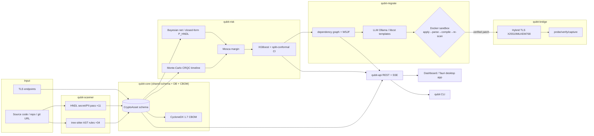

# QUBIT — Paper Authoring Kit (hand this to your co-author)

**Purpose.** Everything needed to write the paper: full technology stack with versions, the novelty
claim positioned against related work, every table and figure spelled out with real data, the
architecture diagram, measured efficiency/test numbers, and a reference list. Companion to
`RESEARCH_PAPER.md` (the manuscript draft) and `qubit-research-paper.html` (styled reading copy).

**Ground truth:** all numbers measured from the repository at commit `7de4756`. Claim tags:
**[M]** measured · **[Mod]** modeled (deliberate simulation) · **[F]** future work (not yet run).
**Do not present [Mod]/[F] as measured empirical results.**

---

## 1. Technologies used (complete, with versions) — TABLE 1

Use as the paper's "Implementation / Tech Stack" table. Versions are the pinned floors in the repo.

### 1.1 Core platform / languages
| Layer | Technology | Version | Role in QUBIT |
|---|---|---|---|
| Language | Python | 3.12 (pinned <3.14) | All 7 backend packages |
| Language | TypeScript | ~5.6 | Dashboard |
| Pkg/build | uv (Astral) | 0.10.x | Monorepo workspace, lockfile, reproducible env |
| Lint/format | Ruff | ≥0.8 | Lint + format gate |
| Types | mypy | ≥1.13 | Static typing gate (qubit-core strict) |
| Tests | pytest (+xdist, hypothesis) | ≥8 | 252 test functions → 331 collected cases |
| CI | GitHub Actions | — | ruff + format + per-pkg mypy + pytest + dashboard build |

### 1.2 Discovery (`qubit-scanner`)
| Technology | Version | Role |
|---|---|---|
| tree-sitter | ≥0.24, **<0.26** | AST parsing of source (Python/Java/Go) |
| tree-sitter-language-pack | ≥1.12 | Grammar bundle |
| pathspec | — | .gitignore-style file filtering |
| (stdlib `re`) | — | HNDL secret/PII pattern pass (11 patterns) |

> **Cite this as an engineering finding:** tree-sitter 0.26.0's binding SIGSEGVs during query
> processing; QUBIT pins `>=0.24,<0.26` with a regression test — a real robustness fix worth a
> sentence in the paper. **[M]**

### 1.3 Risk engine (`qubit-risk`)
| Technology | Version | Role |
|---|---|---|
| NumPy | ≥2.0 | Monte-Carlo CRQC simulation vectors |
| SciPy | ≥1.13 | Distributions, Gauss-Legendre integration |
| pgmpy | ≥1.0 | 5-node Bayesian network (HNDL exposure) |
| XGBoost | ≥2.0 | Distillation regressor (calibrated risk score) |
| scikit-learn | ≥1.4 | Split-conformal prediction, metrics |
| (transformers, torch) | ≥4.44 / ≥2.2 | DistilBERT tier — **documented negative result**, opt-in |

### 1.4 Migration (`qubit-migrate`)
| Technology | Version | Role |
|---|---|---|
| networkx | ≥3.3 | Dependency graph, SCC condensation, topo order |
| libcst | ≥1.4 | Deterministic Python codemods (template transforms) |
| Ollama (local LLM) | qwen2.5-coder:7b | LLM patch generation (offline) |
| Docker | 29.x | Network-disabled sandbox for patch validation |

### 1.5 Bridge (`qubit-bridge`)
| Technology | Version | Role |
|---|---|---|
| OpenSSL | 3.5.x | Native ML-KEM/ML-DSA; negotiates X25519MLKEM768 |
| nginx (hybrid image) | 1.31 | Hybrid TLS terminator |
| tshark/tcpdump (optional) | — | Handshake pcap capture |

### 1.6 Platform + UI (`qubit-api`, `qubit-cli`, dashboard, desktop)
| Technology | Version | Role |
|---|---|---|
| FastAPI | ≥0.139 | REST API |
| Pydantic (v2) | ≥2.7 | Schemas/validation (frozen `CryptoAsset`) |
| SQLAlchemy | ≥2.0.30 | ORM (SQLite default, Postgres optional) |
| Alembic | ≥1.18 | Schema migrations |
| uvicorn | ≥0.35 | ASGI server |
| sse-starlette | ~3.4 | Server-Sent Events (live job progress) |
| Typer + Rich | ≥0.12 | CLI |
| cyclonedx-python-lib | ≥11.11 | CycloneDX 1.7 CBOM export |
| React | 18/19 | Dashboard |
| Vite | 8.x | Frontend build |
| TanStack Query + Table | 5.x / 8.x | Server state + inventory table |
| Plotly.js | 3.x | CRQC timeline + risk charts |
| Framer Motion | 12.x | Motion (drawer, press feedback) |
| Tauri | 2.x (Rust) | Native desktop app (Windows .exe + installer) |

---

## 2. Novelty — how to position it — TABLE 2 (feature comparison)

**The novelty is the *synthesis*, not any single stage.** No prior open system connects
discovery → calibrated HNDL risk → verification-gated remediation → on-wire proof, framed around the
full HNDL *exposure surface*. State it exactly that way; do not claim to beat any single-purpose tool
at its one job.

### 2.1 Novelty claims (rank in the paper)
1. **Unified offline HNDL loop** — the four stages in one reproducible artifact. **[M functional]**
2. **HNDL exposure-surface model** — discovery beyond crypto algorithms to secrets/keys/tokens/PII,
   each with an exploit narrative; the risk framing is "what an HNDL adversary harvests," not "what
   algorithm is weak." **[M]**
3. **Fused calibrated risk** — Monte-Carlo CRQC arrival × data-shelf-life under Mosca, distilled to
   an XGBoost score with split-conformal CIs + TreeSHAP; two independent exposure formulations
   (closed-form vs. Bayesian net) cross-validate to <0.02. **[Mod]**
4. **Safety-gated LLM migration** — a bad patch *cannot* merge (sandbox apply→parse→compile→re-scan);
   safety is the claim, not LLM accuracy. **[M pipeline]**
5. **On-wire proof** — same-port classical→hybrid swap verified as X25519MLKEM768. **[M]**

### 2.2 Feature-comparison table (fill baselines from their papers/docs)
| Capability | CryptoGuard | CogniCrypt | CBOM tools (e.g. cbomkit) | LLM-rewrite research | **QUBIT** |
|---|---|---|---|---|---|
| Crypto misuse/asset discovery | ✓ | ✓ | ✓ | ✗ | ✓ |
| HNDL exposure surface (secrets/PII) | ✗ | ✗ | ✗ | ✗ | **✓** |
| CRQC-arrival risk model (Mosca) | ✗ | ✗ | ✗ | ✗ | **✓** |
| Calibrated risk score + CI | ✗ | ✗ | ✗ | ✗ | **✓** |
| CycloneDX 1.7 CBOM | ✗ | ✗ | ✓ | ✗ | ✓ |
| Automated PQC code patch | ✗ | partial | ✗ | ✓ | ✓ |
| Patch safety gate (can't merge if broken) | ✗ | ✗ | ✗ | ✗ | **✓** |
| Runtime hybrid-TLS proof | ✗ | ✗ | ✗ | ✗ | **✓** |
| Fully offline / local LLM | n/a | n/a | varies | usually cloud | **✓** |

> Verify each competitor cell against its primary source before submission; mark any you can't
> confirm as "—" rather than guessing.

---

## 3. Measured results — TABLES 3–5

### TABLE 3 — System scale (measured at `7de4756`) **[M]**
| Package | Source LOC (non-test) | Test functions | Primary role |
|---|---|---|---|
| qubit-core | 1,940 | 33 | Schema, registry, CBOM |
| qubit-scanner | 1,690 | 63 | Discovery + HNDL surface |
| qubit-risk | 2,861 | 43 | HNDL risk engine |
| qubit-migrate | 2,636 | 50 | Graph + migration + sandbox |
| qubit-bridge | 949 | 5 | Hybrid TLS proof |
| qubit-api | 2,440 | 31 | REST spine |
| qubit-cli | 1,633 | 27 | CLI |
| **Total (Python)** | **14,149** | **252** | (→ **331** collected cases via parametrization) |
| Dashboard (TypeScript) | 2,915 | — | React UI |

### TABLE 4 — Detection coverage **[M]**
| Detector | Count | Notes |
|---|---|---|
| Crypto rule files | 8 | Python (5), Java (2), Go (1) |
| Individual crypto rules | 34 | AST-query rules over tree-sitter |
| HNDL secret/PII patterns | 11 | AWS/GitHub/Slack/Google/Stripe/JWT/PEM/password + email/CC/SSN |
| Asset types (schema) | 7 | algorithm-use, protocol, certificate, key, library, **secret**, **sensitive-data** |
| Languages (code scan) | 3 | Python, Java, Go |

### TABLE 5 — Quality gate & consistency results **[M]**
| Metric | Value | How obtained |
|---|---|---|
| Automated tests passing | 331 collected, all pass | `uv run pytest packages -q` |
| Lint | ruff clean | `ruff check` |
| Types | mypy clean (per-package) | `mypy <pkg>/src` |
| Bayesian-net vs. closed-form P_HNDL | agree to <0.02 | internal cross-validation test |
| Split-conformal coverage (synthetic) | ~90.5% | conformal calibration on synthetic set **[Mod]** |
| Coverage gate (core pkgs) | ≥70% (CI-enforced) | pytest-cov |

> **Efficiency note to write honestly:** these are *functional/consistency* numbers. Detection
> precision/recall, patch pass@k, and handshake-overhead latency are **[F]** — see §5.

---

## 4. Figures & graphs to produce — with exact sources

Each figure below is generatable from the running app or the codebase — no fabrication needed.

| Fig | Title | What it shows | Source / how to capture |
|---|---|---|---|
| **F1** | System architecture | 7 packages + data flow (discovery→risk→migrate→bridge) through the shared schema/DB/API | Use the mermaid in §6; render at mermaid.live or via the dashboard |
| **F2** | CRQC-arrival CDF | `P(CRQC ≤ year)` 2026–2060 with P05/P50/P95 markers | Screenshot the **CRQC Timeline** page (Plotly), or re-plot the `RiskRun.timeline` JSON |
| **F3** | Risk-scored inventory | Assets incl. **HNDL secret/PII** findings, risk bars, Mosca margin | Screenshot the **Inventory** page after a scan |
| **F4** | HNDL exposure-surface breakdown | Count by asset type (crypto vs. secret vs. PII) as a bar/treemap | Screenshot **Risk Posture**, or aggregate `/scans/{id}/summary` |
| **F5** | Before→after remediation | Re-scan proving the vulnerable asset count dropped (e.g. MD5 1→0) | Run `uv run qubit run <path>`; screenshot the before/after table |
| **F6** | Hybrid handshake proof | Negotiated group X25519MLKEM768 on TLS 1.3 (classical vs. hybrid) | `qubit bridge verify --expect X25519MLKEM768` output / pcap |
| **F7** | Risk score + conformal CI | Per-asset score with the split-conformal interval + top TreeSHAP features | Inventory drawer / `/assets/{id}/risk/explain` |
| **F8** (opt) | Dependency graph | Migration units (SCC condensation), topo order | **Migrations → Dependency Graph** tab |

**Graphs specifically worth plotting (not just screenshots):**
- CRQC CDF (F2) — line + shaded 5–95% band.
- Handshake latency: classical vs. hybrid, mean±stdev bars — **[F]**, needs the E4 run.
- Risk-score histogram across a real scanned repo (F4).

---

## 5. Evaluation plan to actually run (turns [F] into [M]) — TABLE 6

Your co-author should run at least E1 before submission; a single real P/R/F1 number transforms the paper.

| Suite | Metric | Dataset / method | Baseline(s) | Output figure/table |
|---|---|---|---|---|
| **E1 Discovery** | Precision, Recall, F1 | Labeled crypto corpus (e.g. CryptoAPI-Bench + hand-labeled repos) | CryptoGuard, CogniCrypt | Table of P/R/F1 + ablation |
| **E2 Risk calibration** | Conformal coverage; Spearman ρ | Collect 40 demo-lab assets × 3 human raters; Bradley-Terry consensus | expert ranking | Calibration plot + ρ |
| **E3 Patch quality** | pass@1/pass@k; template success | Rule/fixture set through the sandbox | — (report as-is) | Bar chart per rule |
| **E4 Handshake overhead** | ms mean/p50/p95 | pcap-timestamp + `tc netem` (classical vs. hybrid) | classical TLS | Latency bars |

> The harness for E2's Spearman study exists (`qubit risk eval --pairwise … --scores …`). **Never
> fabricate the human ratings** — collect real ones or report E2 as future work.

---

## 6. Architecture diagram (mermaid — paste into mermaid.live for F1)

---

## 7. References (starter bibliography — verify + format to venue style)

Standards & primary sources (must-cite):
1. NIST FIPS 203 — Module-Lattice-Based Key-Encapsulation Mechanism (ML-KEM), 2024.
2. NIST FIPS 204 — Module-Lattice-Based Digital Signature Algorithm (ML-DSA), 2024.
3. NIST FIPS 205 — Stateless Hash-Based Digital Signature Standard (SLH-DSA), 2024.
4. P. W. Shor, "Polynomial-Time Algorithms for Prime Factorization and Discrete Logarithms on a
   Quantum Computer," SIAM J. Computing, 1997.
5. L. K. Grover, "A fast quantum mechanical algorithm for database search," STOC 1996.
6. M. Mosca, "Cybersecurity in an era with quantum computers: will we be ready?" IEEE S&P, 2018.
   (Mosca's inequality.)
7. C. Gidney and M. Ekerå, "How to factor 2048 bit RSA integers in 8 hours using 20 million noisy
   qubits," Quantum, 2021.
8. M. Webber et al., "The impact of hardware specifications on reaching quantum advantage in the
   fault-tolerant regime," AVS Quantum Science, 2022.
9. Global Risk Institute, "Quantum Threat Timeline Report" (expert-survey CRQC estimates), latest ed.
10. IETF draft — Hybrid key exchange in TLS 1.3 (X25519MLKEM768 / X25519Kyber768 code point).
11. OWASP / OASIS CycloneDX — Cryptography Bill of Materials (CBOM), spec 1.7 (ECMA-424).
12. NIST SP 1800-38 / NCCoE — Migration to Post-Quantum Cryptography.

Tooling & methodology (for related work + methods):
13. S. Rahaman et al., "CryptoGuard: High Precision Detection of Cryptographic Vulnerabilities in
    Massive-sized Java Projects," ACM CCS 2019.
14. S. Krüger et al., "CogniCrypt: Supporting Developers in Using Cryptography," ASE 2017.
15. V. Vovk, A. Gammerman, G. Shafer, "Algorithmic Learning in a Random World" (conformal
    prediction), Springer 2005.
16. T. Chen and C. Guestrin, "XGBoost: A Scalable Tree Boosting System," KDD 2016.
17. S. Lundberg and S.-I. Lee, "A Unified Approach to Interpreting Model Predictions" (SHAP),
    NeurIPS 2017.
18. R. A. Bradley and M. E. Terry, "Rank Analysis of Incomplete Block Designs" (Bradley-Terry), 1952.
19. M. Brand et al. / tree-sitter — "Tree-sitter: an incremental parsing system" (cite the project).
20. A. Ankan and A. Panda, "pgmpy: Probabilistic Graphical Models using Python," SciPy 2015.

> Fill in exact volumes/pages and match the target venue's citation style (IEEE numeric is typical
> for Annexure-I/SCOPUS CS venues).

---

## 8. Suggested paper section → source map (so your co-author knows where each claim comes from)

| Paper section | Pull content from | Tag |
|---|---|---|
| Abstract, Intro | `RESEARCH_PAPER.md` §Abstract, §1 | mixed |
| Threat model | `RESEARCH_PAPER.md` §2; `docs/design/02` | Mod |
| System / architecture | §3 + §6 mermaid here; `docs/design/00` | M |
| Discovery + HNDL surface | §4 here; `qubit_scanner/secrets/` code | M |
| Risk methodology | §5 in manuscript; `docs/design/02` | Mod |
| Migration + safety gate | §6 in manuscript; `docs/design/03` | M |
| Runtime proof | §6.3; `docs/design/04` | M |
| Evaluation | §5 here (the plan); run E1 first | F |
| Implementation/scale | Tables 1, 3, 4, 5 here | M |
| Limitations | manuscript §9 | — |

---

## 9. Honesty checklist before submission (critical for the viva)
- [ ] No [Mod]/[F] number is stated as a measured empirical result.
- [ ] The CRQC timeline is described as a *simulation/model*, never a prediction.
- [ ] At least E1 (discovery P/R/F1) run on a small labeled set, OR evaluation clearly framed as
      "designed, in progress."
- [ ] The DistilBERT negative result is reported honestly (strengthens credibility).
- [ ] Every competitor cell in Table 2 is verified against its source or marked "—".
- [ ] Figures are real screenshots/plots from the artifact, captioned with how they were produced.
