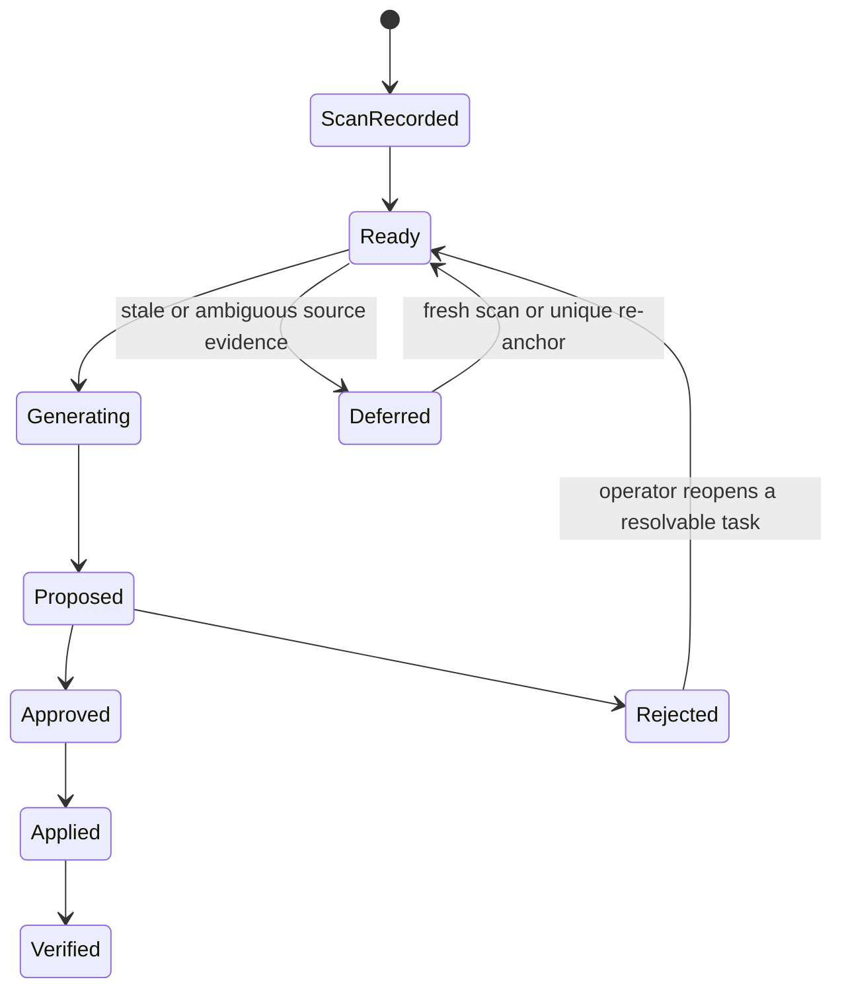

# QUBIT Project Validation Report

**Assessment date:** 14 September 2026  
**Scope:** current QUBIT repository, production desktop build, targeted regression suite, four-repository desktop replication records, and the eight-page research manuscript.

## Executive status

QUBIT is a credible research prototype and desktop workbench for evidence-bound post-quantum cryptography (PQC) migration. Its strongest implemented idea is not autonomous cryptographic replacement: it is the audit trail that separates a detected source occurrence from a proposed patch, an approved patch, an applied patch, and a verified outcome.

The current source passes the targeted regression suite (**98 passed, 2 warnings, 69.47 s**), dashboard lint, dashboard production build, and Tauri desktop packaging build. The packaged Windows installer was produced successfully. The four-repository deterministic desktop replication record reports four completed re-scans, zero parse failures, and scanner findings changing from 92 to 86 after six reviewed edits. That last number is scanner evidence only; it is not a semantic-correctness or security-proof metric.

The paper is now an eight-page IEEE-style manuscript with explicit evidence limits, formulas, architecture and workflow diagrams, a real desktop screenshot, a replication graph, six data tables, and only verified IEEE references. The original rich manuscript remains preserved under `unwanted/release-cleanup-20260914/`.

## 1. Project map

| Area | Main responsibility | Evidence inspected |
|---|---|---|
| `dashboard/` | React/Vite UI, Tauri desktop shell, bundled Windows application | production build, lint, Tauri bundle |
| `packages/qubit-api/` | FastAPI routes, jobs, persisted task/scan APIs | API tests, migration routes |
| `packages/qubit-scanner/` | Tree-sitter source scanning, rule catalogue, crypto normalisation | scanner source and regression references |
| `packages/qubit-migrate/` | task orchestration, patch proposal, approval, application, validation | state, validator, re-anchor tests |
| `packages/qubit-risk/` | risk analysis and scoring support | reviewed as supporting functionality, not a claimed novel formula |
| `packages/qubit-core/` | shared domain models and utilities | repository topology |
| `packages/qubit-bridge/` | interoperability/bridge support | repository topology |
| `packages/qubit-cli/` | command-line workflows | repository topology |
| `qubit-v2/data/` | replication records and paper artefacts | JSON/log inventory and paper revision |

### 1.1 Runtime architecture


The important boundary is between candidate generation and application. QUBIT can use a local generator and can be configured with external providers, but a candidate remains untrusted until validation and explicit approval allow the working tree to change. The default release configuration disables external source processing.

## 2. Core workflow and safeguards



### 2.1 Discovery

The scanner is tree-sitter based. It produces source-aware findings that identify the file, source location, rule, algorithm family, and surrounding evidence. This is stronger than a raw regular-expression scan, but it is still static analysis: it is not a whole-program data-flow proof, reachability proof, or semantic execution result. The repository pins tree-sitter below 0.26 because the newer binding had a native heap-corruption regression; this pin is covered by a regression test.

### 2.2 Planning and ownership

QUBIT distinguishes a value that can be changed locally from one tied to a protocol, stored format, or established key-derivation process. The implementation uses source structure and nearby documentation as evidence. This is an intentionally conservative decision layer: a `refuse`, `defer`, or `dual-path` outcome is better than a locally consistent but operationally invalid replacement.

The most important current limitation is that ownership is largely source-local. A constraint may be expressed in a different function, a different module, a remote protocol specification, or an existing persisted data contract. Cross-finding graph reasoning remains the highest-value research improvement.

### 2.3 Validation

QUBIT records an evidence ladder rather than a single passed/failed result. The policy distinguishes:

- established gates that actually ran and passed;
- gates that are structurally not applicable to a rule/language;
- skipped gates caused by an unavailable environment or dependency; and
- failed gates.

This matters because a skipped compilation or behavioural test must not be reported as a pass. For an applied patch, scanner removal, parsing, a language-specific behaviour relation, and a full project suite each mean different things. The paper now states this explicitly and avoids treating scanner count reduction as proof of semantic correctness.

### 2.4 Stale evidence protection

An earlier source edit can move the line stored for a later task in the same file. The hardening work introduced deterministic re-anchoring. A later task is restored only when its source occurrence can be matched uniquely; missing or ambiguous evidence becomes a deferred task requiring a fresh scan. This prevents the dangerous failure mode in which a valid line number points at the wrong cryptographic occurrence after an earlier patch.

### 2.5 Human approval and application

Application is policy-gated. A non-approved patch cannot be applied. The migration API includes task reopening for operator-controlled recovery, but reopening does not bypass evidence or approval. Application re-examines the file after writing instead of trusting only the command exit code.

## 3. Evidence and data status

### 3.1 Current release evidence

| Evidence item | Current verified result | Interpretation |
|---|---:|---|
| Targeted regression suite | 98 passed, 2 warnings, 69.47 s | executable regression coverage, not 98 research trials |
| Dashboard lint | passed | static UI quality check |
| Dashboard production build | passed | deployable frontend bundle generated |
| Tauri production build | passed | compiled `qubit-desktop.exe` and NSIS installer generated |
| Desktop packaging rerun | passed outside sandbox | initial in-sandbox failure was Windows `EPERM`, not a source defect |
| Four-repository desktop record | 4 / 4 re-scans succeeded, 0 parse failures | historical deterministic desktop replication evidence |
| Applied edits in that record | 6 | reviewed source edits, not independently adjudicated migrations |
| Scanner findings in that record | 92 -> 86 | scanner-removal measure only |

The current test command was:

```powershell
uv run pytest packages/qubit-migrate/tests/test_engine_order.py `
  packages/qubit-migrate/tests/test_sandbox_selection.py `
  packages/qubit-migrate/tests/test_tests_oracle.py `
  packages/qubit-migrate/tests/test_stale_location_reanchor.py `
  packages/qubit-migrate/tests/test_task_resolution.py `
  packages/qubit-migrate/tests/test_satisfied_is_line_scoped.py `
  packages/qubit-api/tests/test_migrate_job_accounting.py `
  packages/qubit-api/tests/test_api.py -q
```

The warnings are dependency deprecations in Starlette's test client and `pgmpy`; no test failed.

### 3.2 Four-repository desktop replication record

| Repository | Recorded base commit | Findings before -> after | Reviewed applied edits | Re-scan |
|---|---|---:|---:|---|
| MediVault EMR | `6a08a584b9fa` | 28 -> 27 | 1 | succeeded |
| Inkwell eSign | `f0426d3ccf55` | 21 -> 18 | 3 | succeeded |
| Sentinel IDP | `680984a3c8ff` | 26 -> 24 | 2 | succeeded |
| Paymesh Gateway | `fc410f718faa` | 17 -> 17 | 0 | succeeded |
| Total | — | 92 -> 86 | 6 | 4 / 4 succeeded |

Nine semantically unsafe proposals were rejected in the same recorded campaign. Two further Inkwell proposals became stale after an earlier same-file write and were left unapplied. Those negative outcomes are important: they show that the workflow can stop instead of manufacturing a change.

### 3.3 Data that is historical, not promoted to a current result

The old rich manuscript contains larger ablations, model-routing comparisons, and aggregate correctness narratives. They are preserved in the archive but are not presented as current verified results in the new paper unless their exact configuration, denominator, and independent adjudication can be reproduced. This prevents a mismatch between a historical campaign database and the current release.

## 4. Desktop application quality

### 4.1 Startup and lifecycle

The desktop shell starts the local Python API. A lifecycle bug was found in which killing only the immediate process could leave the descendant API alive. The desktop shutdown logic now terminates the API process tree, and the release smoke record confirms that the API port is released after a normal desktop close.

Startup performance was improved by reducing bundled Latin font assets and replacing an ineffective dynamic API-base import with a static import. The dashboard CSS bundle is now 58.92 kB (11.35 kB gzip). The largest remaining frontend cost is a deferred Plotly chunk of approximately 4.66 MB (about 1.39 MB gzip). It is not on the first screen's critical path, but it should be further split before a large public rollout.

### 4.2 Build warning

Vite reports a chunk-size warning for the Plotly-containing chunk. This is a performance warning, not a build failure. The recommended remediation is route- or feature-level code splitting around the heaviest visualization modules, followed by a cold-start measurement on representative hardware.

### 4.3 Security and privacy posture

- Local-first operation is the baseline; external source processing is disabled by default.
- An external model, if enabled, is only a candidate generator and is not trusted as validation evidence.
- Non-approved patches are blocked from application.
- The app now has explicit stale-evidence behaviour instead of applying by an obsolete location.
- Repository source should still be considered sensitive. Enabling an external model needs an explicit source-transfer and privacy policy.

## 5. Defects found and status

| Priority | Finding | Current status | Recommended next action |
|---|---|---|---|
| P0 | Same-file write can stale a later recorded source location | fixed with deterministic re-anchor/defer behaviour | expand tests to multi-edit and cross-language fixtures |
| P0 | API descendant could survive desktop shutdown | fixed with process-tree shutdown | retain normal-close integration test in release CI |
| P0 | Unapproved patch could be a dangerous apply boundary | policy tested and blocked | add UI-level end-to-end confirmation test |
| P1 | Scan completion timestamps were not consistently persisted | fixed across filesystem/network/vault paths | test schema migration and historical-record backfill |
| P1 | External processing risk could be enabled by default | default changed to disabled | surface a deliberate UI disclosure when enabling it |
| P1 | Tree-sitter 0.26 binding regression | version pinned below 0.26 | track upstream fix and test an isolated upgrade branch |
| P1 | Plotly bundle remains large | known build warning | split reporting/visualization routes; measure cold start |
| P2 | Ownership is source-local | open research limitation | introduce cross-finding dependency/usage graph |
| P2 | Go and Java behaviour coverage is weaker | open evaluation limitation | add native build and metamorphic harnesses |
| P2 | Ground truth is project-authored | open research limitation | independent human labelling and preregistered dataset |

## 6. Recommended improvement plan

### Phase 1 — release reliability

1. Add an automated Windows release smoke test that launches the NSIS-installed application, performs a scan, reopens a task, verifies non-approved apply rejection, performs a normal close, and verifies the API port is closed.
2. Add integration fixtures with two and three same-file edits to stress stale re-anchoring and ensure an ambiguous occurrence always defers.
3. Add a migration-data integrity check that verifies every `applied` task has a matching diff hash and post-apply re-scan record.
4. Add a CI rule that fails on new warnings in the Tauri package build, while allowing the current Plotly size warning until a measured bundle-budget decision is agreed.

### Phase 2 — performance and usability

1. Split the heavy reporting/Plotly code by route and profile cold-start time, memory, and first-interaction latency on a normal developer laptop.
2. Add an operator-facing explanation of the evidence ladder directly beside the approve/apply controls.
3. Present applied, rejected, deferred, and unresolved outcomes as separate visible counts so users cannot infer that unattempted work was successful.
4. Add an exportable evidence package per migration run: manifest, task export, validation JSON, diff hashes, and post-scan summary.

### Phase 3 — research-quality evaluation

1. Build an independently labelled, versioned benchmark with positive cases, negative controls, expected refusal cases, and behavioural oracle definitions.
2. Repeat stochastic generation arms at least three times per repository and report confidence intervals, not a single run.
3. Compare scanner-only, planning-only, approval-gated, and full-validation modes with the same denominator.
4. Add Go/Java behavioural and build harnesses so evidence levels are comparable across languages.
5. Make cross-finding ownership a first-class graph problem: key generation, signatures, protocol use, and stored material must be linked before an automated action is allowed.

## 7. Paper revision details

The revised manuscript is deliberately more defensible than the earlier long paper:

- exactly eight pages in Microsoft Word;
- two-column IEEE-style layout;
- recovered architecture diagram, evidence-ladder diagram, and genuine desktop screenshot;
- new workflow diagram and scanner-count graph derived from the recorded replication table;
- native Word math for ownership, evidence-level, and acceptance expressions;
- explicit data-status appendix that separates current release evidence from old exploratory records;
- manifest, task-state, current regression, and claim-to-evidence tables;
- only verified IEEE references in the bibliography;
- no claim of a new cryptographic primitive, universal automation, independent benchmark accuracy, or proof that scanner removal equals semantic correctness.

## 8. Publication-readiness assessment

The paper is now a much stronger project paper and a transparent engineering case study. It is not yet ready to claim broad research generalisation. Before submitting to an IEEE venue, complete the independent dataset and repeated-run plan, release an artefact package, obtain at least one independent human labeler, and replace the remaining scanner-only outcomes with behavioural or maintained-suite evidence where possible.

The right publication position is: **an evidence-preserving, human-governed source-level PQC migration workbench evaluated on a fixed multi-language case-study corpus**. This is a clear and credible contribution. It should not be marketed as the first PQC migration lifecycle, a universal automatic cryptographic migration system, or a replacement for an organisation's PQC governance programme.

